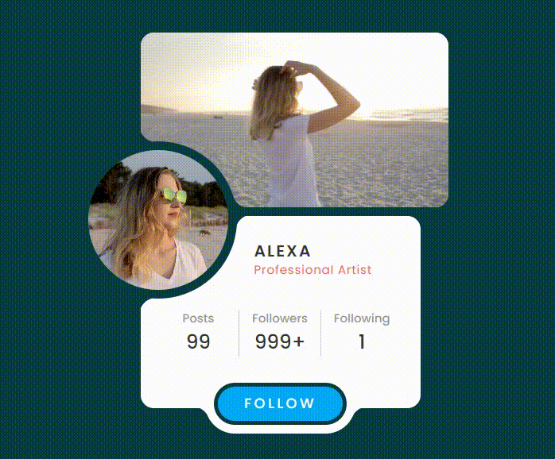
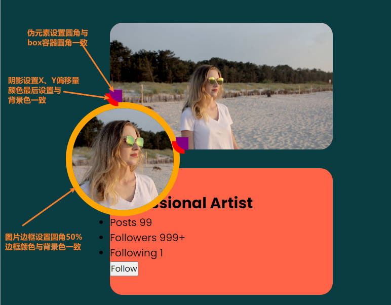

## CSS创作个人主页介绍卡片，展示独特魅力
## 使用CSS技巧实现图片与卡片交叉处的平滑效果

## 前面
在现代网页设计中，个人主页是一个展示个人信息、技能、事件等的重要载体。为了吸引访客的注意力并提供良好的用户体验，设计师通常会运用各种技巧和效果来增加页面的吸引力。本文将介绍如何使用CSS创建一个漂亮的个人主页卡片，展示独特魅力🦋。

## PREVIEW
<p align=center>

</p>

## 创建HTML结构
首先，需要定义基本的HTML结构来容纳个人主页介绍卡片；

这里外层使用一个`div`包裹，里面使用三个`<div>`元素作为包裹容器布局，并在其中添加所需的图像、内容和按钮等：
```HTML
<div class="card">
  <div class="box">
    <div class="img_box">
      <video 
        src="./assets/video.mp4"
        muted
        autoplay
        loop
      />
    </div>
  </div>

  <div class="box">
    <div class="content">
      <h2>
        Alexa
        <br>
        <span>
          Professional Artist
        </span>
      </h2>

      <ul>
        <li>
          Posts
          <span>22</span>
        </li>
        <li>
          Followers
          <span>999+</span>
        </li>
        <li>
          Following
          <span>7</span>
        </li>
      </ul>

      <button>Follow</button>
    </div>
  </div>

  <div class="circle">
    <div class="img_box">
      
    </div>
  </div>
</div>
```
外层是`card`容器，视频和文本内容区域是上下布局的，分别使用`box`容器包裹，最后是`circle`容器包裹头像在定位在中间左边超出；

> 注：
> video设置属性：静音(`muted`)可实现自动播放(`autoplay`)，接着设置循环播放(`loop`)；
> 
> img>和video>的父容器是一个类名`img_box`；


## 添加元素样式
接下来，我们将使用CSS来为个人主页介绍卡片添加样式。以下是一些关键的样式属性和技巧，可以使卡片看起来更加漂亮和吸引人；

### Base CSS
  * 使用通配符选择器`*`来为页面中的所有元素设置相同的样式，清除默认样式，使用怪异盒子模型；
  * 选择文档的根元素（HTML中的 <html>）定义颜色`CSS变量`；
  * body使用flex把`card`容器布局在页面水平、垂直居中；
  * card使用flex把三个子容器实现垂直排列并两端对齐；
```css
* {
  margin: 0;
  padding: 0;
  box-sizing: border-box;
}

:root {
  --clr: #083d41
}

body {
  display: flex;
  justify-content: center;
  align-items: center;
  min-height: 100vh;
  background-color: var(--clr);
}

.card {
  background-color: var(--clr);
  position: relative;

  width: 320px;
  height: 430px;
  display: flex;
  flex-direction: column;
  justify-content: space-between;
}

/* 先把容器基本样式调整一下 */
.card .box {
  background-color: tomato;
  position: relative;
  
  width: 110%;
  height: 200px;
  /* 文本内容区域圆角 */
  border-radius: 20px;
}

/* 头像容器则使用定位布局 */
.card .circle {
  width: 180px;
  height: 180px;
  position: absolute;
  left: -70px;
  top: 50%;
  transform: translateY(-50%);
  border-radius: 50%;
  border: 10px solid var(--clr);
}

/* 调整img和video共有的父容器样式 */
.card .box .img_box,
.card .circle .img_box {
  position: absolute;
  inset: 0;
  overflow: hidden;
  /* img的圆角 */
  border-radius: 50%; 
}
.card .box .img_box {
  /* video的圆角 */
  border-radius: 15px;
}

/* 调整图片和视频的样式 */
.card .box .img_box video,
.card .circle .img_box img {
  position: absolute;
  width: 100%;
  height: 100%;
  object-fit: cover;
}
```

### 视频区域CSS
调整`card`下的第一个`box`容器样式，也就是包裹视频的容器：
  * 包围图片的边框部分，优化成圆角使其看上去不是那么突兀；
  * 使用`::before`，`::after`创建两个伪元素用于需要优化的两角；
  * 设置伪元素的左下角边框圆角程度与`box`保持一致，当然也可以自行调整；
  * 最后给伪元素添加阴影效果覆盖住`box`的角，然后阴影颜色设置为与背景色一致，就能实现了：
    - 属性可设置的值包括阴影的 X 轴偏移量、Y 轴偏移量、模糊半径、扩散半径和颜色；
    - 比如本次设置的值对应：X轴偏移-6px Y轴偏移6px 颜色；
```css
.card .box:nth-child(1)::before {
  content: "";
  width: 20px;
  height: 20px;
  background-color: transparent;
  
  position: absolute;
  z-index: 10;
  top: 106px;
  left: -1px;
  border-bottom-left-radius: 20px;
  box-shadow: -6px 6px var(--clr);
}

/* 样式同before类似，注意定位样式 */
.card .box:nth-child(1)::after {
  content: "";
  width: 20px;
  height: 20px;
  background-color: transparent;
  
  position: absolute;
  z-index: 10;
  bottom: -1px;
  left: 105px;
  border-bottom-left-radius: 20px;
  box-shadow: -6px 6px var(--clr);
}
```
目前添加样式效果图，可以在调试阶段更改明显色彩用于调整距离、位置等；



### 文本内容CSS
调整`card`下的第二个`box`容器样式，也就是包含文字信息的容器：
  * 包围图片的边框部分，优化成圆角样式同上面类似，部分需要调整的看代码；
  * 注意这里设置的是伪元素的左上角圆角程度，然后添加阴影颜色实现；
  * 此外，还对卡片内部的标题、段落和列表应用了特定的样式，以使其在视觉上更加吸引人；
```css
.card .box:nth-child(2) {
  background-color: #fff;

  width: 100%;
  height: 220px;
}

.card .box:nth-child(2)::before {
  content: "";
  width: 20px;
  height: 20px;
  background-color: transparent;

  position: absolute;
  z-index: 10;
  bottom: 106px;
  left: -1px;
  border-top-left-radius: 20px;
  box-shadow: -6px -6px var(--clr);
}
.card .box:nth-child(2)::after {
  content: "";
  width: 20px;
  height: 20px;
  background-color: transparent;

  position: absolute;
  z-index: 10;
  top: -1px;
  left: 109px;
  border-top-left-radius: 20px;
  box-shadow: -6px -6px var(--clr);
}

.card .box .content {
  position: absolute;
  inset: 0;
  padding: 30px 10px 20px;
  display: flex;
  flex-direction: column;
  align-items: center;
  gap: 20px;
}

/* 姓名和Title样式 */
.card .box .content h2 {
  width: 100%;
  padding-left: 120px;
  text-transform: uppercase;
  letter-spacing: 0.1em;
  line-height: 1.1em;
  font-size: 1.15em;
  font-weight: 600;
  color: #333;
}
.card .box .content h2 span {
  letter-spacing: 0.05em;
  font-size: 0.75em;
  font-weight: 400;
  color: tomato;
  text-transform: initial;
}

/* 列表样式 */
.card .box .content ul {
  position: relative;
  top: 15px;

  width: 100%;
  padding: 0 10px;
  display: grid;
  grid-template-columns: repeat(3, 1fr);
}
.card .box .content ul li {
  list-style: none;
  display: flex;
  flex-direction: column;
  align-items: center;
  padding: 0 10px;
  font-size: 0.85em;
  font-weight: 500;
  color: #999;
}
.card .box .content ul li:not(:last-child)
{
 border-right: 1px solid #ccc; 
}
.card .box .content ul li span{
  font-size: 1.65em;
  color: #333;
}

/* 按钮样式 */
.card .box .content button {
  position: relative;
  top: 25px;
  padding: 8px 30px;
  border: none;
  outline: none;
  background-color: #03a9f4;
  border-radius: 30px;
  color: #fff;
  font-size: 1em;
  letter-spacing: 0.2em;
  text-transform: uppercase;
  font-weight: 500;
  cursor: pointer;
  border: 5px solid var(--clr);
  box-shadow: 0 0 0 10px #fff;
  transition: .5s;
}
.card .box .content button:hover {
  letter-spacing: 0.5em;
  background-color: #ff3d7f;
}
```

## 进一步优化
由于按钮的圆角与文本内容卡片的交界处看上去显得有些过于突兀了；
所以现在把它们的交界处优化成弧形，样式类似`box`的伪元素，这里也给按钮创建两个伪元素，用于优化两边的交界处：
```css
.card .box .content button::before {
  content: "";
  width: 20px;
  height: 20px;
  background-color: transparent;
  position: absolute;
  top: 23px;
  left: -29px;
  border-top-right-radius: 20px;
  box-shadow: 5px -7px #fff;
}

.card .box .content button::after {
  content: "";
  width: 20px;
  height: 20px;
  background-color: transparent;
  position: absolute;
  top: 23px;
  right: -29px;
  border-top-left-radius: 20px;
  box-shadow: -5px -7px #fff;
}
```

## 最后
除了基本样式之外，还进一步优化个人主页介绍卡片的细节。一些可选的技巧包括：
  * [x] 添加过渡效果：通过为`button`的容器元素添加过渡效果，使卡片在鼠标悬停时平滑地改变样式(背景色、字符间距)；
  * [x] 使用伪元素添加`box-shadow`技巧覆盖比较突兀的地方，使各个元素之间的交界处有过渡感，可以增加视觉上的吸引力；
  * [x] 通过给元素设置与`body`背景相同的颜色，可以使其在页面中更加突出和立体；

通过运用CSS的各种样式属性和技巧，我们可以轻松地创建漂亮的个人主页介绍卡片。这些卡片不仅能够有效地展示个人信息和技能，还能够吸引访客的注意力并提供良好的用户体验。记得尝试不同的样式和效果来定制你自己独特的个人主页卡片！
