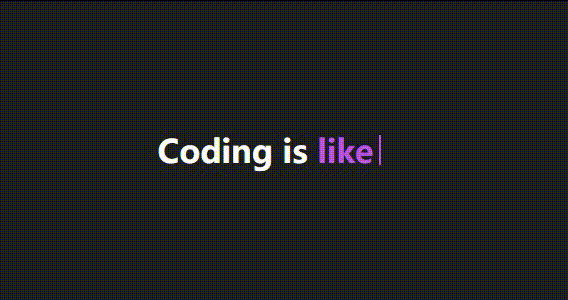
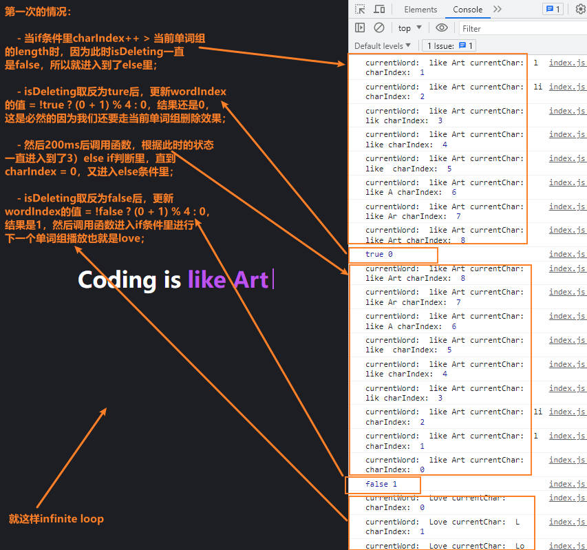

# 「创意与动感并存」创建无限循环几组文字的文本输入 | 打字机动画效果

## 前面
当涉及到网页和用户交互时，创新和动感的动画效果是吸引用户注意力和提升用户体验的关键之一。其中一种动画效果是`打字机动画`，在访问很多数人博客的时候，会发现在网站首页通常会使用这个效果来简单**介绍自己**或是一句**正能量**句子亦或是主打的**slogan**！

打字动画是为了模拟人类的输入和思考过程，并与用户进行有趣而自然的交流。这种设计回复文字的方式具有以下几个优点：
* [x] 仿真性：打字动画通过逐字符显示文本，模拟了人类逐渐输入的过程。这种逐步展示的方式使得回复看起来更加真实和自然，就像一个实时的对话过程；
* [x] 可读性：通过逐字符显示文本，用户能够更清楚地跟踪阅读进度。相比于一次性呈现所有文本，逐字展示使得内容更易于阅读和理解；
* [x] 吸引力：打字动画增添了互动性和视觉吸引力，使用户在等待回复时感到更加有趣。这种逐字展示的方式可以在一定程度上引起用户的好奇心，让他们期待下一个字符的出现；

接下来本文将详细介绍如何使用`HTML`、`CSS`和`JavaScript`实现这一炫酷效果，来为网页添加生动性，为用户带来过目就忘的体验😅。

<p align=center>

</p>

## Let's get started
### 构建HTML页面： 
首先需要创建一个基本的`index.html`页面，在`<body>`标签中，添加一个带有`空白<span>元素的<h1>标题`。其中这个`<span>`元素将用于展示打字特效，另外又新建`style.css`和`index.js`文件用于编写元素样式和脚本，并在当前文件中引入：
```html
<!DOCTYPE html>
<html lang="en">
<head>
  <meta charset="UTF-8">
  <meta name="viewport" content="width=device-width, initial-scale=1.0">
  <title>Typing Text Effect</title>

  <link rel="stylesheet" href="./style.css">
</head>
<body>
  <h1>Coding is <span></span></h1>

  <script src="./index.js"></script>
</body>
</html>
```

### 添加CSS样式： 
通过在`<head>`标签中链接一个外部CSS文件后，我们可以在style.css中为页面添加样式。在这里，我们定义了整体样式、字体大小、文字颜色和闪烁动画等属性：
* 使用CSS变量来定义页面的颜色方案，以提供可定制性；
* 使用flex布局把元素放在页面水平垂直居中；
* 使用span创建::before伪元素实现光标；
* 使用animation为光标添加无限闪烁效果；
* 使用stop-blinking类名时置空闪烁；
  ```css
  * {
    margin: 0;
    padding: 0;
    box-sizing: border-box;
  }

  :root {
    --body-color: #1d1e23;
    --primary-color: #ffffff;
    --second-color: #bd53ed;
  }

  body {
    display: flex;
    justify-content: center;
    align-items: center;

    min-height: 100vh;
    background-color: var(--body-color);
  }

  h1 {
    font-size: 2rem;
    color: var(--primary-color);
  }
  h1 span {
    color: var(--second-color);
    position: relative;
  }
  h1 span::before {
    content: "";
    width: 2px;
    height: 30px;
    background-color: var(--second-color);
    
    position: absolute;
    right: -8px;
    top: 50%;
    transform: translateY(-50%);

    animation: blink .7s infinite;
  }

  @keyframes blink {
    50% {
      opacity: 0;
    }
  }

  h1 span.stop-blinking::before {
    animation: none;
  }
  ```


### 编写JS代码： 
接下来，使用JavaScript来实现打字特效。代码中定义了一些变量用于跟踪当前展示的单词和字符索引，以及删除状态。通过递归延迟调用typingEffect()函数，根据字符索引来逐个显示或删除字符，通过不断的延迟和更新索引，使得文本看起来像是在被打字或删除；
```js
/**
 * 需要播放的单词组，先把数组每一项看做一组，所以这里是设置了四组单词； 
 * 获取显示每组字符的容器；
*/
const words = ["like Art", "Life", "the Future", "Everything"],
      dynamicText = document.querySelector("h1 span");

let wordIndex = 0,
    charIndex = 1,
    isDeleting = false;

function typingEffect() {
  const currentWord = words[wordIndex]; //当前展示的单词组
  const currentChar = currentWord.substring(0, charIndex); //当前显示的字符 

  /**元素设置字符的同时，添加停止闪烁类名 */
  dynamicText.textContent = currentChar;
  dynamicText.classList.add("stop-blinking");

  /** 1. 每个单词组播放 */
  if (!isDeleting && charIndex < currentWord.length) {
    charIndex++;
    
    setTimeout(typingEffect, 200);
  } else if (isDeleting && charIndex > 0) {
    /**
     * 3. 设置删除每个字符的效果
     */
    charIndex--;
    
    setTimeout(typingEffect, 200);
  } else {
    /** 
     * 2.设置当前需要删除的单词组或下一个要播放的单词组:
    */
    isDeleting = !isDeleting;
    wordIndex = !isDeleting ? (wordIndex + 1) % words.length : wordIndex;

    dynamicText.classList.remove("stop-blinking");
    setTimeout(typingEffect, 200);
  }
};

typingEffect();
```
通过上面代码可以实现一个简单的打字效果，使用了JavaScript来动态地在一个`<span>`标签中展示一组预定义的单词，并实现逐个字符的打印和删除效果；
* 首先，通过querySelector选择器找到`<h1>标签内的<span>`元素，并将其赋值给变量`dynamicText`；

* 然后，定义了几个变量：
  - `wordIndex`：表示当前展示的单词组的索引，初始为0。这里指`like Art`；
  - `charIndex`：表示当前展示字符的索引，初始为1。这里指`l`；
  - `isDeleting`：表示文本是否正在进行删除效果，默认为`false`；

* 接下来，定义了一个名为typingEffect的函数，用于实现打字效果：
  - 函数中首先获取当前展示的单词组，通过`words[wordIndex]`获取，存储在变量`currentWord`中；
  - 然后，根据`charIndex`截取出当前应该显示的字符，存储在变量`currentChar`中；
  - 之后，将`currentChar`设置为`dynamicText`元素的文本内容，即将其显示在页面上；
  - 接下来，通过`添加CSS类名"stop-blinking"`来停止闪烁效果，以使文本看起来更加稳定。

* 最后通过判断条件来决定是逐个字符打印还是删除，分为三个条件：
  1）如果`isDeleting为false`且`charIndex小于当前单词组的长度`，则递增charIndex，表示继续打印下一个字符，并通过setTimeout函数将执行延迟200毫秒后调用typingEffect函数；

  2）当完成一个单词的打印或删除后，`isDeleting状态取反`，并根据`isDeleting是否为true来更新wordIndex`的值。**为false时**wordIndex会在每个单词的索引之间循环，并通过(wordIndex + 1) % words.length计算下一个单词的索引，**反之isDeleting为ture时**还是其本身第一次是0；最后，`移除CSS类名"stop-blinking"`以恢复闪烁效果，并通过setTimeout函数将执行延迟200毫秒后再次调用typingEffect函数，从而开始下一个单词的打印或者当前单词的删除效果；
 
  3）如果`isDeleting为true`且`charIndex大于0`，则递减charIndex，表示开始删除字符，并同样通过setTimeout函数将执行延迟200毫秒后调用typingEffect函数；  

整个过程将不断重复，实现了连续展示一组预定义单词的打字效果。

#### 渲染图


#### Node.textContent
[Node](https://developer.mozilla.org/zh-CN/docs/Web/API/Node) 接口的 `textContent` 属性表示一个节点及其子节点的文本内容:
```html
<div id="app">
  This is <span>some</span> text!
</div>

<script>
const text = document.getElementById("app").textContent;
console.log(text); //This is some text!
</script>
```
> 如果节点是一个 `document`，则 `textContent` 返回 `null`，如果你要获取整个文档的文本，可以使用`document.documentElement.textContent`；
> 

在节点上设置 textContent 属性的话，会删除它的所有子节点，并替换为一个具有给定值的文本节点；
```html
<script>
document.getElementById("app").textContent = "This text is different!";
// <div id="app">This text is different!</div>
</script>
```

##### 与 innerText 的区别 
* `textContent` 会获取所有元素的内容，包括 `<script>` 和 `<style>` 元素，然而 `innerText` 只获取页面中给看到的元素；
* `textContent` 会返回节点中的每一个元素。相反，`innerText` 受 `CSS` 样式的影响，并且不会返回隐藏元素的文本(`display: "none"`)，此外，由于 `innerText` 受 `CSS` 样式的影响，它会触发回流（ reflow ）去确保是最新的计算样式。（回流在计算上可能会非常昂贵，因此应尽可能避免）；

##### 与 innerHTML 的区别 
如其名该属性设置或获取 HTML 语法表示的元素，为了在元素中获取或写入文本，通常使用 innerHTML。但是，textContent 通常具有更好的性能，因为文本不会被解析为 HTML。
此外，使用 textContent 可以防止 XSS 攻击。

### 关于扩展性：
实现这个效果时并没有考虑过多的扩展性，因为这个版本相对来说比较全面一点。想要更多扩展的话，可以通过外界传入一些标识，然后在原来的逻辑上进行判断处理，或者创建多个函数，不同情况调用不同函数；
* 比如你只有**一组句子**需要循环播放，那么你可以固定一个当前词字段：
  ```js
  function typingEffect2() {
    const currentWord = "creativity";
    const currentChar = currentWord.substring(0, charIndex);

    dynamicText.textContent = currentChar;
    dynamicText.classList.add("stop-blinking");

    if (!isDeleting && charIndex < currentWord.length) {
      charIndex++;
      
      setTimeout(typingEffect2, 200);
    } else if (isDeleting && charIndex > 0) {
      charIndex--;
      
      setTimeout(typingEffect2, 200);
    } else {
      isDeleting = !isDeleting;

      dynamicText.classList.remove("stop-blinking");
      setTimeout(typingEffect2, 200);
    }
  };

  typingEffect2();
  ```
* 比如你不想**无限循环**播放，而是播放完一段句子就停止：
  ```js
  function typingEffect3() {
    const currentWord = "creativity";
    const currentChar = currentWord.substring(0, charIndex);

    dynamicText.textContent = currentChar;
    dynamicText.classList.remove("stop-blinking");

    if (charIndex < currentWord.length) {
      charIndex++;
      
      dynamicText.classList.add("stop-blinking");
      setTimeout(typingEffect3, 200);
    }
  };

  typingEffect3();
  ```


## 最后
通过使用`HTML`、`CSS`和`JavaScript`创建文本输入的打字机动画效果，为网页增添了*创意和动感*，吸引了用户和读者的注意力。他们能够看到文字逐渐出现，就像是一台真实的打字机正在工作；

这种交互式的效果不仅提高了用户参与度，还为网页增添了一种有趣的元素。总而言之独特而引人注目的效果将吸引用户与读者，并给他们留下深刻印象。无论是在个人网站、品牌推广页面还是产品展示中，打字机动画效果都是一种有效的方式之一；

源码我放在了[GitHub](https://github.com/vnyoon/web-magic)，里面还有一些酷炫的效果、动画案列，喜欢的话不要忘了 `starred` 不迷路！
