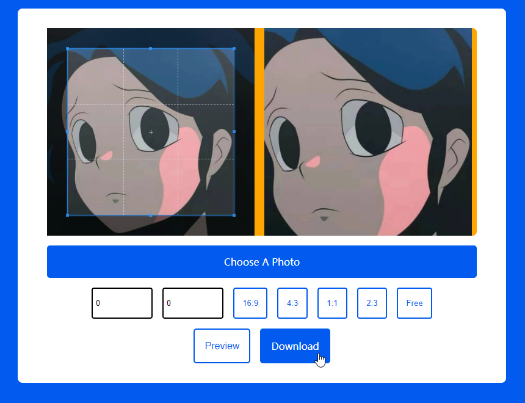

## 裁剪并下载图片

使用`Cropper.js`库在线上传图片进行处理，支持预览、下载：
  * 自由裁剪、输入宽高、比例16:9、4:3等裁剪；

> Cropper.js：
> [Github](https://github.com/fengyuanchen/cropperjs)；
> [Website](https://fengyuanchen.github.io/cropperjs/)；
