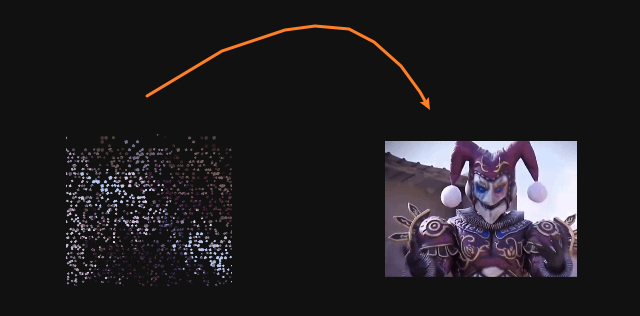
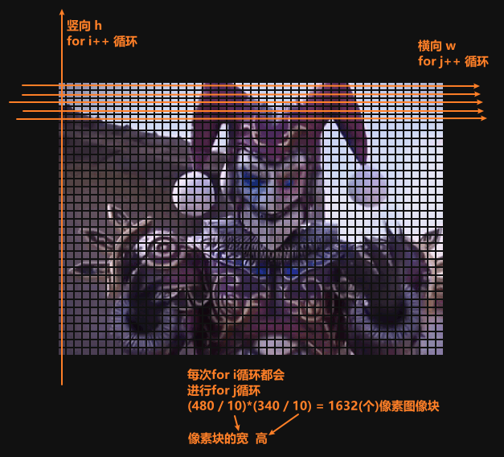

# 「像素化图像」一定要铠甲才能让你兴奋吗？看好了我可不是铠甲勇士

## 💻
在本篇文章中将介绍如何通过使用`HTML`、`CSS`和`JavaScript`创建大把`awesome`**像素图像动画效果**。这个动画效果会动态的逐渐显示一个**由多个很多像素图像组成的图片**，并对像素图像应用关键帧动画效果，还设置了每个像素图像的不同延迟时间来实现整体的动态效果💥。

<p align=center>

</p>

## 筑造HTML🪵
首先，让我们构建起`HTML`结构的基础，为即将制作的像素图像动画铺平道路：
  * 在这个HTML文档中，我们引入了一个外部的CSS文件 `style.css` 和一个外部的JavaScript文件 `index.js`；
  * 同时，我们定义了一个包含 `class="box" 的 <div>` 元素作为包裹内容容器，并在其中创建了一个 `id="pixel" 的 <div>` 元素，用于承载我们的每一个像素图像；
    ```html
    <!DOCTYPE html>
    <html lang="en">
    <head>
      <meta charset="UTF-8">
      <meta name="viewport" content="width=device-width, initial-scale=1.0">
      <title>Pixel Image Animation</title>

      <link rel="stylesheet" href="./style.css">
    </head>
    <body>
      <div class="box">
        <div id="pixel"></div>
      </div>
      
      <script src="./index.js"></script>
    </body>
    </html>
    ```

## 基本CSS⚒️
像素图像的动画将通过CSS动画来实现。下面是`style.css`中的样式代码，用于定义像素图像动画的样式：
  * 首先对所有元素应用了一些基本的样式重置，然后定义了一些CSS变量来控制盒子和像素图像的尺寸；
  * 在 `.box` 类选择器中，将容器设置为相对定位，并使用 `--box-w` 和 `--box-h` 这两个CSS变量来定义它的宽度和高度；
  * 在 `.box span` 类选择器中，将每个像素元素设置为绝对定位，并使用 `--pixel-w-h` 这个CSS变量来确定每个像素的宽高，为像素元素设置了背景图片->此时称为**像素图像**，动画效果等像素元素创建完后再添加；
    ```css
    * {
      margin: 0;
      padding: 0;
      box-sizing: border-box;
    }

    :root {
      --box-w: 480px;
      --box-h: 340px;
      --pixel-w-h: 10px;
    }

    body {
      display: flex;
      justify-content: center;
      align-items: center;
      min-height: 100vh;
      background-color: #111;
    }

    .box {
      position: relative;
      width: var(--box-w);
      height: var(--box-h);
    }
    .box span {
      position: absolute;
      width: var(--pixel-w-h);
      height: var(--pixel-w-h);
      background-image: url(./logo.jpg);
      background-repeat: no-repeat;

      /* animation: animate 10s linear infinite;*/
    }
    ```

## 魔法JavaScript🪄
首先需要想一下需要多少个像素块铺满整个`内容区域`(创建多少个像素块)？
  * 当然，这取决于内容区域的大小(宽高)，而内容区域的尺寸取决于图片的大小。比如：这里使用的是`480x340`的图片尺寸；
  * 每个像素块的大小通过前面设置的css已经决定了，这个无非是密度多与少的问题，块越小密度越大(密密麻麻)，块尺寸越大密度越小(稀稀拉拉)。比如：这里使用的是`10x10`(刚刚好好)前提是图片的尺寸是`300x300`宽和高同等时看上去更加立体，总之块尺寸还是依赖于图片尺寸的；
那么这里就是需要`(480/10) * (340/10) = 1632`个像素块；

接下来的这段JavaScript代码的主要功能是创建一个个像素块，然后在页面上生成一系列位于不同位置的`<span>`元素，这些元素在不同的延迟时间后逐个显示，从而形成一个逐渐显现的像素化图像。具体分析如下：
  1. **常量定义：**
    - `IMG_W` 和 `IMG_H` 定义了图像的宽度和高度，分别为480x340；
    - `PIXEL_W_H` 定义了每个像素块的宽度和高度，为10；
  2. **变量计算：**
    - `h` 计算了图像高度除以像素高度，以确定生成多少组像素块。比如这里是：`Math.ceil(IMG_H / PIXEL_W_H)`(组)；
    - `w` 计算了图像宽度除以像素宽度，以确定每组生成多少个像素块。比如这里是：`Math.ceil(IMG_W / PIXEL_W_H)`(个)；
    - 这里向上取整的原因，是因为如果出现**小数**的情况下就**多渲染一组span元素，**避免像素图像显示不完整；
  3. **嵌套循环：**
    - 外层循环遍历一条纵向组，即图像的高度上分成多少组。比如这里是：`34`组；
    - 内层循环遍历每组内的横向像素块，即每组生成多少个像素块。比如这里是：`48`个；
    - 每一次for i循环，就会运行一次for j循环，结果一共是创建了`34*48=1632`个像素块；
  4. **设置span样式：**
    - 使用 `span.style.left` 和 `span.style.top` 设置像素块的位置，根据当前行和列索引乘以像素块的宽高，以实现逐个平铺。比如前两个：(left=0x10=0，top0x10=0)，(left=1x10=10，top=0x10=0)；
    - 使用 `span.style.backgroundPositionX` 和 `span.style.backgroundPositionY` 设置背景图像的偏移位置，实现像素图像的显示效果；
    - 使用 `span.style.animationDelay` 设置动画延迟，每个像素块的动画在不同的时间开始，从而创建逐个出现的效果；
  5. **创建文档片段：**
    - 使用 `document.createDocumentFragment()` 创建一个新的空白的文档片段，用于一次性把所有生成的 `<span>` 元素添加到DOM树中。因为文档片段存在于内存中，并不在 DOM 树中，所以将子元素插入到文档片段时不会引起页面回流。因此，使用文档片段通常会带来更好的性能；
  ```javascript
  const IMG_W = 480;
  const IMG_H = 340;
  const PIXEL_W_H = 10;

  const h = Math.ceil(IMG_H / PIXEL_W_H),
        w = Math.ceil(IMG_W / PIXEL_W_H),
        pixel = document.getElementById("pixel");

  function pixelImg() {
    const fragment = document.createDocumentFragment();

    for (let i = 0; i < h; i++) {
      for (let j = 0; j < w; j++) {
        const decimal = Math.random().toFixed(1);
        const span = document.createElement("span");

        // 控制台调试：
        // span.setAttribute("y-count", i + 1);
        // span.setAttribute("x-count", j + 1);
        // span.style.border = "1px solid #000";

        span.style.left = j * PIXEL_W_H + "px";
        span.style.top = i * PIXEL_W_H + "px";
        span.style.backgroundPositionX = -j * PIXEL_W_H + "px";
        span.style.backgroundPositionY = -i * PIXEL_W_H + "px";

        span.style.animationDelay = decimal + "s"; // 每个span开始执行动画之前等待的时间 '0.1'、'0.8'、'0.2'、'0.9'、'0.6'...

        fragment.appendChild(span);
      }
    };

    pixel.appendChild(fragment);
  };

  pixelImg();
  ```

> 图片上的公式应该是：`(340 / 10)*(480 / 10)=1632`比较恰当一点！🫢
### 另一种方式
通过直接循环总共需要的**像素块总数**，减少了一层循环嵌套，如下：
```js
function pixelImg() {
  const fragment = document.createDocumentFragment();

  for (let i = 0; i < h * w; i++) {
    const decimal = Math.random().toFixed(1);
    const span = document.createElement("span");

    // 计算列数
    const col = i % w;
    // 计算行数
    const row = Math.floor(i / w);

    const styles = {
      left: `${col * PIXEL_W_H}px`,
      top: `${row * PIXEL_W_H}px`,
      backgroundPositionX: `${-col * PIXEL_W_H}px`,
      backgroundPositionY: `${-row * PIXEL_W_H}px`,
      animationDelay: `${decimal}s`
    };

    Object.assign(span.style, styles);
    fragment.appendChild(span);
  };

  pixel.appendChild(fragment);
};
```

## 动画CSS♨️
通过js把像素图像们创建出来后，最后把动画效果应用到它们上；
在 `@keyframes` 中，定义了一个名为 `animate` 的关键帧动画，这个动画包含了一系列关键帧，每个关键帧设定了不同的变换效果，就是最终像素图像的动态效果了。具体来说：
  * **0%和10%**：像素图像在初始状态，不缩放、不旋转、不平移；
  * **20%和30%**：像素图像缩小到原始大小的一半，不旋转、不平移、原点保持中心位置；
  * **40%**：像素图像保持缩小状态，顺时针旋转360度，并水平方向向右平移150px，变换原点设置在距离元素左边缘100px的；
  * **70%**：像素图像保持缩小状态，顺时针旋转720度，并水平方向向左平移150px，变换原点设置在距离元素左边缘-100px的；
  * **90%**：像素图像放大到原始大小的2.5倍，不旋转、不平移，变换原点位于中心；
  * **100%**：动画结束，元素恢复到初始状态，不缩放、不旋转、不平移，原点保持中心位置；
    ```css
    .box span {
      /* 这里的代码省略了 */

      animation: animate 10s linear infinite;
    }

    @keyframes animate {
      0%, 
      10% {
        scale: 1;
        rotate: 0deg;
        translate: 0 0;
        transform-origin: center;
      }

      20%, 
      30% {
        scale: 0.5;
        rotate: 0deg;
        translate: 0 0;
        transform-origin: center;
      }

      40% {
        scale: 0.5;
        rotate: 360deg;
        translate: 150px 0;
        transform-origin: 100px;
      }

      70% {
        scale: 0.5;
        rotate: 720deg;
        translate: -150px 0;
        transform-origin: -100px;
      }

      90% {
        scale: 2.5;
        rotate: 0deg;
        translate: 0 0;
        transform-origin: center;
      }

      100% {
        scale: 1;
        rotate: 0deg;
        translate: 0 0;
        transform-origin: center;
      }
    }
    ```
最后，通过 `animation` 属性，将 `animate` 动画序列应用于像素图像元素上，并设置动画的属性：持续时间为 `10` 秒，动画的时间函数为`线性`，以`无限循环`方式运行。这将使元素不断地按照你定义的关键帧动画变换序列进行动态变化；

> 另外：
>
> 在上面的关键帧动画中，没有明确定义的关键帧（如50%，60%，80%），对于这些关键帧，浏览器会根据已定义的关键帧样式进行平滑的过渡；
>
> 比如这个案列中只定义了特定时间点（0%，10%，20%，30%，40%，70%，90%，100%）的关键帧样式，因此在其它时间点，浏览器会自动插值计算元素的样式；
>
> 通常情况下，如果你希望在动画的某些时间点保持元素的默认样式，你可以选择在这些时间点重复前一关键帧的样式，以达到元素暂时停止变化的效果。这样在创造更加流畅和连贯的动画过程中很有用；

## 🎉
综上所述本文详细的指引了从构建`HTML`到应用`CSS`样式，再到使用`JavaScript`创造动态效果的全过程。通过将CSS动画和JavaScript DOM操作融合在一起，打造出精彩的像素图像动画，为静态图像注入"生命"，营造出充满活力的视觉盛宴。

最后你也可以根据自己的需求和喜好，调整像素大小、动画效果和图像等，来创建自己的个性化像素图像动画效果。希望本文对你理解和实现类似动画有所帮助！如果你对该案例还有任何问题，欢迎在评论区留言或联系(私信)我。谢谢阅读！

源码我放在了[GitHub](https://github.com/vnyoon/web-magic)，里面还有一些酷炫的效果、动画案列，喜欢的话不要忘了 `starred` 不迷路！
