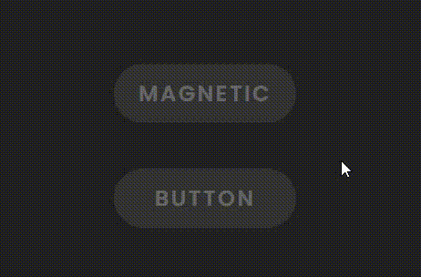
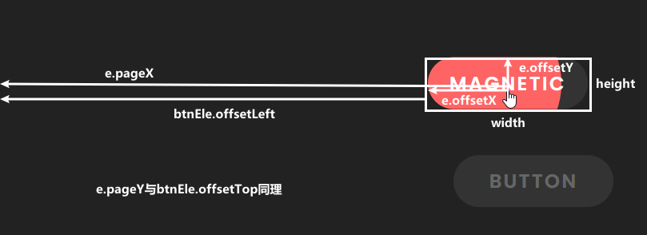

# 创意按钮交互：方向感知磁性悬停效果🧲

## 前面
本篇文章中主要详细介绍**方向感知按钮**的实现，接下来将使用 `HTML` 结构、`CSS` 样式和 `JavaScript` 事件处理来实现。通过逐步分析代码，特别关注 `JavaScript` 的部分，以便能够完全理解实现这一交互效果的过程🚀；

话说在*前端*中界面的交互性是吸引用户和创造难忘体验的关键元素💣。一个有趣且引人入胜的交互效果"**磁性悬停效果**"，这个效果在用户悬停在按钮上时会吸引用户的注意力，同时给界面带来动态和有趣的感觉。它使按钮在鼠标悬停上面时像**磁铁**一样跟随鼠标移动，另外还给按钮添加了会扩展开的背景色显得更生动一些✨。[showtime](https://code.juejin.cn/pen/7275583398058393659)！

<p align=center>

</p>

**<p align=center>移动端建议在PC端查看效果~</p>**

## HTML 结构
HTML 结构非常简单，由两个带有 `.btn` 类的锚点元素（`<a>`）组成，分别表示两个按钮。这俩按钮就是在鼠标悬停上面时触发磁性悬停效果；
* 按钮会扩展开的背景色通过在内联样式中定义为变量。这样做的便捷就是不用再添加不同类名，进而设置不同背景色了；
* `<span>` 就纯展示文字内容；
* 引入外部 `CSS`、`JS` 文件；
```html
<!DOCTYPE html>
<html lang="en">

<head>
  <meta charset="UTF-8">
  <meta name="viewport" content="width=device-width, initial-scale=1.0">
  <title>Direction Aware Magnetic Hover Effect</title>

  <link rel="stylesheet" href="./css/style.css">
</head>

<body>
  <a href="#" class="btn" style="--clr: #ff6464">
    <span>
      Magnetic
    </span>
  </a>

  <a href="#" class="btn" style="--clr: #29aeef">
    <span>
      Button
    </span>
  </a>

  <script src="./js/main.js"></script>
</body>

</html>
```
> 另外，扩展开的背景色是通过**伪元素**添加的，见下面CSS。

## CSS 样式
* 当用户悬停在按钮上时，背景会扩展开。扩展开的圆圈的颜色由前面内联样式中定义的变量 `--clr` 决定；
* 其中，扩展圆圈的位置是通过`js`计算出来，添加在按钮内联样式中的CSS变量（--x和--y）；
```css
* {
  margin: 0;
  padding: 0;
  box-sizing: border-box;
}

/* 背景颜色和布局设置 */
body {
  min-height: 100vh;
  background-color: #222;

  display: flex;
  gap: 50px;
  flex-direction: column;
  justify-content: center;
  align-items: center;
}

/* 按钮样式，包括背景、文本和过渡属性 */
.btn {
  position: relative;

  width: 200px;
  display: flex;
  justify-content: center;
  align-items: center;

  padding: 15px 20px;
  background-color: #333;
  border-radius: 40px;

  text-decoration: none;
  text-transform: uppercase;
  font-size: 1.5em;
  font-weight: 600;
  letter-spacing: .1em;

  transition: transform .1s;
  overflow: hidden;
}
.btn span {
  position: relative;
  color: rgba(255, 255, 255, .25);
  transition: color .5s;
}
/* 悬停时文本颜色变化 */
.btn:hover span {
  color: rgba(255, 255, 255, 1);
}


/* 悬停时会扩展开的圆圈样式 */
.btn::before {
  content: "";
  position: absolute;
  top: var(--y);
  left: var(--x);
  transform: translate(-50%, -50%);
  background-color: var(--clr);
  width: 0;
  height: 0;
  border-radius: 50%;
  transition: 1s, left 0s, top 0s;
}
.btn:hover::before {
  width: 200px;
  height: 200px;
}

```

## JavaScript 交互
* 首先，获取需要添加效果的按钮，为每个按钮添加`"mousemove"`、`"mouseout"`事件监听器（通常指鼠标的光标在元素内移动时、移动至元素或其子元素之外时）；
* 接着，获取鼠标相对于**按钮内部的坐标（`x`和`y`）** 以及 **按钮的宽高**，计算出鼠标在按钮内部的偏移量相对于按钮中心点的位置。通过 `transform` 属性将按钮平移到鼠标位置；
* 同时，获取鼠标在整个**文档的坐标**，并减去**按钮相对于边界的偏移量**，确定鼠标相对于按钮的位置。通过 `setProperty` 动态设置变量的值；
* 最后，使用 `mouseout` 事件在光标离开按钮时将按钮重置为原始状态；
```javascript
const btns = document.querySelectorAll(".btn");

btns.forEach(btnEle => {
  btnEle.addEventListener("mousemove", e => {
    const x = e.offsetX,
          y = e.offsetY,
          btnWidth = btnEle.clientWidth,
          btnHeight = btnEle.clientHeight,
          transX = x - btnWidth / 2,
          transY = y - btnHeight / 2;

    btnEle.style.transform = `translateX(${transX}px) translateY(${transY}px)`;

    const mx = e.pageX - btnEle.offsetLeft,
          my = e.pageY - btnEle.offsetTop;

    btnEle.style.setProperty("--x", mx + "px");
    btnEle.style.setProperty("--y", my + "px");
  });

  btnEle.addEventListener("mouseout", () => {
    btnEle.style.transform = "";
  });
});
```

### 表现

> `HTMLElement.offsetLeft` 获取当前元素相对于 `HTMLElement.offsetParent` 节点的左边界偏移的像素值。注意，如果当前元素的父元素，设置了 `position` 属性值，只要不为 `static`，那么 `offsetParent` 就是 父元素；

## 最后
这种效果的核心在于 `JavaScript` 代码。使扩展的圆圈在用户的光标移动到按钮区域内时跟随光标，从而创建出磁性效果。总而言之，如果想要在某些界面上添加互动效果，也许**磁性悬停效果**也是一种选择之一，可以增强用户在你的界面上的交互体验，吸引用户🤩。现在通过结合**前端三剑客**，你也可以创建出用户在悬停时具有磁性效果的按钮。`CSS` 提供了效果的**视觉**方面，而 `JavaScript` 则为圆圈扩展的动态行为添加了**动态**效果，这种有趣的交互为界面添加了活泼的触感；

或者甚至你也可以根据自己的需求进行调整，进一步改善和扩展这个效果。希望这篇文章对你在开发类似交互动画效果时有所帮助！如果你对这个案列还有任何问题，欢迎在评论区留言或联系(私信)我。谢谢阅读，Happy Coding🎉！

源码我放在了[GitHub](https://github.com/vnyoon/web-magic)，里面还有一些酷炫的效果、动画案列，喜欢的话不要忘了 `starred` 不迷路！
