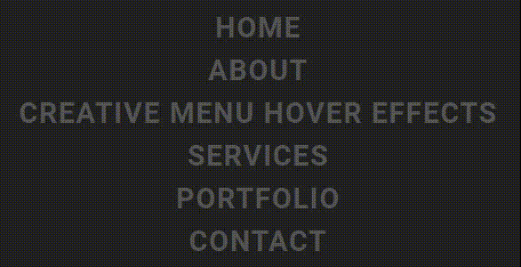

# 生动有趣的创意「菜单导航」悬浮交互效果

## 前面
说起来在以*输出内容为核心*的网站开发中非常常见的一种导航就是**菜单导航**，它清晰的展示网站的几个大致主要内容方向都有哪些，方便浏览者能够快速的定位找到自己感兴趣的方向🥓，并且支持点击进入对应的内容**锚点**或者路由**页面**。不过对于这样的菜单导航来说，很少做过多的交互，一般常见的也就是**悬浮高亮**等。本篇文章主要详细介绍使用`HTML`、`CSS`、`JavaScript`对网站菜单导航在悬浮高亮的基础上添加更丰富生动的交互效果。[showtime](https://code.juejin.cn/pen/7277868567302209570)！

<p align=center>

</p>

**<p align=center>移动端建议在PC端查看效果~</p>**

## HTML
* 引入外部`CSS`和`JS`文件；
* 创建一组无序列表，其中`li`中预设需要的内容；
* `#cursor`元素是用于替换默认*鼠标光标*，实现鼠标移入页面光标的效果；
```html
<!DOCTYPE html>
<html lang="en">

<head>
  <meta charset="UTF-8">
  <meta name="viewport" content="width=device-width, initial-scale=1.0">
  <link rel="stylesheet" href="./css/style.css">

  <title>Creative Menu Hover Effects</title>
</head>

<body>
  <ul>
    <li>Home</li>
    <li>About</li>
    <li>Creative Menu Hover Effects</li>
    <li>Services</li>
    <li>Portfolio</li>
    <li>Contact</li>

    <div id="cursor"></div>
  </ul>

  <script src="./js/index.js"></script>
</body>

</html>
```

## CSS
* 重置样式、字体，页面布局居中等，禁用默认光标；
* `span`元素是通过js生成的，具体看后面js逻辑；
```css
/* @import url('https://fonts.googleapis.com/css2?family=Roboto:wght@700&display=swap'); */
@import './google-fonts.css';

* {
  margin: 0;
  padding: 0;
  box-sizing: border-box;
}

li {
  list-style: none;
}

body {
  display: flex;
  justify-content: center;
  align-items: center;
  min-height: 100vh;
  background-color: #222;

  font-family: 'Roboto', sans-serif;
  cursor: none;
}

ul {
  display: grid;
  row-gap: 10px;
  justify-items: center;
}
ul li {
  text-align: center;
  color: #555;
}
ul li span {
  font-size: 2em;
  letter-spacing: 0.05em;
  transition: .25s;
  text-transform: uppercase;
}
ul li:hover span {
  color: #fff;
  text-shadow: 0 0 5px #fff, 0 0 15px #fff, 0 0 30px #fff, 0 0 60px #fff, 0 0 100px #fff;
}

#cursor {
  position: fixed;
  transform: translate(-50%, -50%);
  
  width: 20px;
  height: 20px;
  background-color: #fff;
  border-radius: 50%;
  box-shadow: 0 0 5px #fff, 0 0 15px #fff, 0 0 30px #fff, 0 0 60px #fff;
  
  pointer-events: none;
  opacity: 0;
  transition: opacity .5s;
}
body:hover #cursor {
  opacity: 1;
}
```
> `box-shadow`属性给元素添加阴影效果：X轴偏移 Y轴偏移 模糊半径 扩散半径 颜色；
> 
> 如果要在一个元素上设置多个阴影，要用`","`分隔开。比如上面的例子，阴影效果是叠加的，而不是覆盖；

## JavaScript
主要逻辑就是把`li`里的文本内容拆分为一个个`span`元素，并在内联样式中添加延迟`40ms`后执行过渡效果的样式，然后设置回li的`innerHTML`；

同时监听了document的`mousemove`(通常指鼠标移动)事件，用于设置`cursor`元素的位置(left = X、top = Y)；

至此，通过预设的`CSS`样式，当自定义的光标悬浮上li元素上时就能看到一个个字符逐渐地高亮起来的效果了；
```js
const texts = document.querySelectorAll('ul li');

texts.forEach(textEle => {
  const textList = textEle.innerText.split('');

  textEle.innerHTML = textList.map((letter, i) => `<span style="transition-delay: ${i * 40}ms">${letter}</span>`).join('');
});

const cursorEle = document.getElementById('cursor');
document.addEventListener('mousemove', e => {
  cursorEle.style.left = e.pageX + 'px';
  cursorEle.style.top = e.pageY + 'px';
});
```


## 最后
通过`HTML`、`CSS`和`JavaScript`的紧密配合，成功的创建了一个简单但小酷的**菜单导航悬浮高亮**交互效果，这种有趣的交互为界面添加了生动的感觉🐇。或者你也可以根据自己的需求进行调整，进一步改善和扩展这个效果。

希望这篇文章对你在开发类似交互动画效果时有所帮助！如果你对这个案列还有任何问题，欢迎在评论区留言或联系(私信)我。谢谢阅读，Happy Coding🎉！

源码我放在了[GitHub](https://github.com/vnyoon/web-magic)，里面还有一些酷炫的效果、动画案列，喜欢的话不要忘了 `starred` 不迷路！
