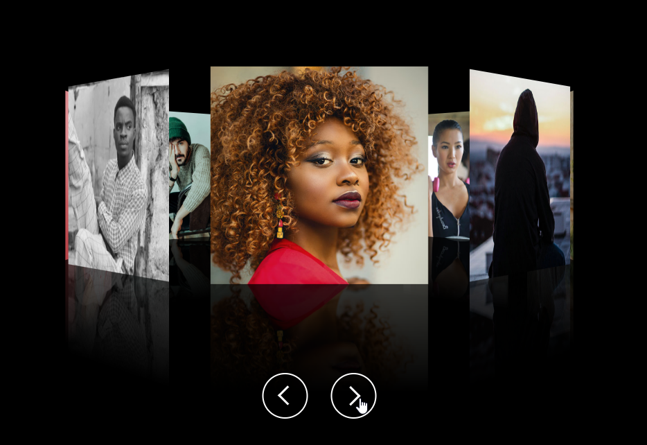

# 「3D视觉相册」画廊展示旋转播放走马灯

## 前面
下面本文将介绍如何使用`HTML`、`CSS`和`JavaScript`实现一个**立体3D视觉效果的相册画廊**展示旋转播放动画效果。每张图片都有不同的旋转和距离设置，增加了视觉上的立体感，支持切换(上一张、下一张)播放。这样的展示效果可以从视觉上产生吸引力，以浏览不同的卡片。话不多说点个赞然后进入正文吧🐇！[showtime](https://code.juejin.cn/pen/7278929410810937396)！

<p align=center>

</p>

## HTML
首先，HTML部分结构是由一个类名为`container`的容器包含`.galleries`图片展示容器和`.arrows`切换按钮容器组成，用于包裹整个画廊；
* `galleries`中包含多个`span`元素，每个span元素放一张图片。其中在内联样式中设置了CSS变量`--i`便于做每张图片的初始的旋转角度(位置)，以排列开；
* `arrows`中包含两个`arrow`元素，分别用于切换上一张`(.prev)`和下一张`(.next)`按钮；
```html
<!DOCTYPE html>
<html lang="en">

<head>
  <meta charset="UTF-8">
  <meta name="viewport" content="width=device-width, initial-scale=1.0">
  <link rel="stylesheet" href="./style.css">

  <title>3D Image galleries</title>
</head>

<body>
  <div class="container">
    <div class="galleries">
      <span style="--i: 1">
        
      </span>

      <span style="--i: 2">
        
      </span>

      <span style="--i: 3">
        
      </span>

      <span style="--i: 4">
        
      </span>

      <span style="--i: 5">
        
      </span>

      <span style="--i: 6">
        
      </span>

      <span style="--i: 7">
        
      </span>

      <span style="--i: 8">
        
      </span>
    </div>

    <div class="arrows">
      <div class="arrow prev"></div>
      <div class="arrow next"></div>
    </div>

  </div>

  <script src="./index.js"></script>
</body>

</html>
```

## CSS
接着，CSS代码样式设置，使用了重置样式、居中和对齐、高度和背景颜色等，就不过多赘述了；
* `.galleries`元素设置`preserve-3d`属性让子元素保留3D转换，`prespective`产生透视效果(元素距离屏幕的距离)；
* `span`元素设置`rotateY`属性，根据*内联样式设置的变量*使每个元素都有按照Y轴旋转的度，并且每个元素之间间隔`translateZ()`，实现3D旋转木马效果。有趣的是，通过设置`-webkit-box-reflect`属性在图片下方创建了反射效果(倒影)，这个效果通过线性渐变和透明度实现，在**浏览器支持**的情况下会显示一个具有倒影的图片；
* 然后就是播放按钮`arrows`的样式，箭头是通过**伪类**设置定位、边框、旋转实现的以及按钮在活动状态下颜色的交互样式；
```css
* {
  margin: 0;
  padding: 0;
  box-sizing: border-box;
}

img {
  width: 100%;
  object-fit: cover;
  user-select: none;
}

body {
  min-height: 100vh;
  background-color: #000;

  display: flex;
  justify-content: center;
  align-items: center;
}

.galleries {
  position: relative;
  
  width: 200px;
  height: 200px;

  transform-style: preserve-3d;
  transform: perspective(1000px) rotateY(0);
  transition: 1.5s;
}

.galleries span {
  position: absolute;
  top: 0;
  left: 0;

  width: 100%;
  height: 100%;
  
  transform: rotateY(calc(var(--i) * 45deg)) translateZ(300px);
  -webkit-box-reflect: below 0px linear-gradient(transparent, transparent, #0004);
}

.arrows {
  position: absolute;
  bottom: 100px;

  display: flex;
  column-gap: 30px;

  color: #fff;
}

.arrows .arrow {
  width: 60px;
  height: 60px;
  border: 2px solid #fff;
  border-radius: 50%;
  
  display: flex;
  justify-content: center;
  align-items: center;

  cursor: pointer;
}
.arrows .arrow::before {
  content: "";

  width: 15px;
  height: 15px;
  border-top: 3px solid #fff;
  border-right: 3px solid #fff;
  
  transform: rotate(45deg) translate(-2.5px, 2.5px);
}
.arrows .arrow.prev::before {
  transform: rotate(-135deg) translate(-2.5px, 2.5px);
}

.arrows .arrow:active {
  background-color: #fff;
}
.arrows .arrow:active::before {
  border-color: #000;
}
```
> 相关文章：
> 
> [CSS简单实现3D戒烟动画🚬](https://juejin.cn/post/7290726887679770676)
> 
> [炫酷的"文字(字母&数字)"雨动画🌧️](https://juejin.cn/post/7270648629378367528)

## JavaScript
最后，负责启用旋转播放画廊功能的JavaScript代码部分就比较简单了，先获取了需要操作的`galleries`、`prev`和`next`按钮元素，并且给按钮的鼠标点击事件赋值处理函数(同一个)，通过传入标识符判断是前/后一张；
* 定义初始值设为0的标识`degress`用于给`galleries`元素设置旋转角度；
* 当`prev`按钮被点击时，增加旋转角度(degrees)，同样地，当`next`按钮被点击时，减少旋转角度(degrees)；
* 然后更新`galleries`元素的`rotateY函数`围绕 Y 轴进行旋转，旋转角度通过计算的 degrees 变量来决定；
```js
const galleries = document.querySelector('.galleries'),
      next = document.querySelector('.next'),
      prev = document.querySelector('.prev');

next.onclick = () => handleGallery('next');
prev.onclick = () => handleGallery();

let degress = 0;

function handleGallery(type = 'prev') {
  type === 'next' ? degress-= 45 : degress+= 45;

  galleries.style.transform = `perspective(1000px) rotateY(${degress}deg)`
};
```

## 最后
通过本篇文章的详细介绍，相信能够帮助你更好地使用`CSS`和`JavaScript`来创建一个**3D相册画廊**播放动画，从而理解掌握和应用这个效果！如果你对这个案列还有任何问题，欢迎在评论区留言或联系(私信)我。码字不易🥲，不要忘了三连鼓励🤟，谢谢阅读，Happy Coding🎉！

源码我放在了[GitHub](https://github.com/vnyoon/web-magic)，里面还有一些酷炫的效果、动画案列，喜欢的话不要忘了 `starred` 不迷路！
