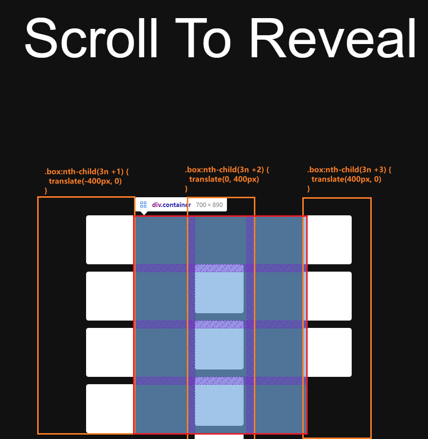

# 「滚动绽放」实现页面滚动时逐渐展示/隐藏元素

本文将介绍如何使用`HTML`、`CSS`和`JavaScript`代码实现**页面在滚动时元素逐渐出现/隐藏**。这个动画效果会在用户滚动/隐藏页面时从不同方向逐渐显示出一组彩色方块🏳️‍🌈。[showtime](https://code.juejin.cn/pen/7280462425919324220)！

<p align=center>

</p>

## HTML结构
首先，`HTML`部分包含了一个`<section>`元素和一个名为`container`的容器，其中包含了多个`box`元素。别忘了引入外部CSS和JS文件；
```html
<!DOCTYPE html>
<html lang="en">
<head>
  <meta charset="UTF-8">
  <meta name="viewport" content="width=device-width, initial-scale=1.0">
  <link rel="stylesheet" href="./style.css">
  
  <title>Scroll To Reveal Animation</title>
</head>
<body>
  <section>
    <h2>Scroll To Reveal</h2>
  </section>

  <div class="container">
    <!-- 调试CSS样式阶段 -->
    <!-- <div class="box"></div>
    <div class="box"></div>
    <div class="box"></div>
    <div class="box"></div> -->
  </div>
  
  <script src="./index.js"></script>
</body>
</html>
```

## CSS样式
接着，设置一些基本的全局样式和居中布局、背景颜色和文字颜色；
* 关于`container`容器，使用grid布局**三列**。
* 对于`box`容器，这部分`CSS`伪类代码定义了元素在动画中的位置和缩放变换。解释一下每个选择器的作用：
  - `.box:nth-child(3n + 1)`：选择容器中**每隔3个**元素的**第一个**方块元素(这里表示第一列)。沿X轴向左平移400像素，缩放为0，即隐藏起来。
  - `.box:nth-child(3n + 2)`：选择容器中**每隔3个**元素的**第二个**方块元素(这里表示第二列)。沿Y轴向下平移400像素，缩放为0。
  - `.box:nth-child(3n + 3)`：选择容器中**每隔3个元素**的**第三**个方块元素(这里表示第三列)。沿X轴向右平移400像素，缩放为0。

这些选择器定义了方块元素的初始状态，使它们在页面加载时处于隐藏状态。并且预设了`.box.active`激活状态的样式；
* 将其平移到原始位置并恢复为原始尺寸，即显示出来。当滚动触发相应的事件时，方块元素将根据添加或移除`active`类来决定是逐渐显示或隐藏。
```css
* {
  margin: 0;
  padding: 0;
  box-sizing: border-box;
  font-family: Arial, Helvetica, sans-serif;
}

body {
  display: flex;
  flex-direction: column;
  justify-content:center;
  align-items: center;

  background-color: #111;
  color: #fff;
  overflow-x: hidden;
}

section {
  min-height: 100vh;
  display: flex;
  justify-content:center;
  align-items: center;
}
section h2 {
  font-size: 8vw;
  font-weight: 500;
}

.container {
  width: 700px;
  position: relative;
  top: -200px;

  display: grid;
  grid-template-columns: repeat(3, 1fr);
  gap: 30px;
}
.container .box {
  width: 200px;
  height: 200px;
  background-color: #fff;
  border-radius: 10px;

  position: relative;
  top: 50vh;
  transition: .5s;
}

.container .box:nth-child(3n + 1) {
  transform: translate(-400px, 0) scale(0);
}
.container .box:nth-child(3n + 2) {
  transform: translate(0, 400px) scale(0);
}
.container .box:nth-child(3n + 3) { 
  transform: translate(400px, 0) scale(0);
}

.container .box.active {
  transform: translate(0, 0) scale(1);
}

```
### 表现
<p align=center>

</p>

## JavaScript实现
最后，使用`JavaScript`生成每个方块并设置了随机的背景颜色，随后将它们添加到`container`容器中，通过监听滚动事件，使方块在用户滚动页面时根据位置添加类名否，应用CSS样式实现逐渐显示或隐藏；
* 定义`randomColor`函数，用于**生成随机的颜色值**。这个函数会从一组字符中随机选择6个字符(每次循环随机取一个)作为颜色代码，并将其拼接成一个十六进制颜色值返回。
* 获取container容器元素，并创建一个文档片段`fragment`用于存储循环创建出来带有背景色的`.box`方块元素，最后将文档片段附加到container中。
* 定义`scrollTrigger`函数，绑定到窗口的滚动事件上。在这个函数中，遍历每个方块，检查**相对于窗口顶部的偏移量**，如果**小于等于当前滚动的距离**，则添加active类，显示方块。反之，则移除active类，隐藏方块。
```js
/**创建随机色 */
const randomColor = () => {
  const chars = "1234567890abcdef",
        colorLegh = 6;
  
  let color = '#';
  for (let i = 0; i < colorLegh; i++) {
    const p = Math.floor(Math.random() * chars.length);
    color += chars.substring(p, p + 1);
  };

  return color;
};

/**创建DOM */
const container = document.querySelector('.container'),
      fragment = document.createDocumentFragment();

for (let i = 0; i < 60; i++) {
  const box = document.createElement('div');
  box.style.backgroundColor = randomColor();
  box.classList.add('box');

  fragment.appendChild(box);
};
container.appendChild(fragment);


/**创建动画 */
const randomColorBlock = document.querySelectorAll('.box');

const scrollTrigger = () => { 
  randomColorBlock.forEach((box) => {
    if (box.offsetTop <= window.scrollY) {
      box.classList.add('active')
    } else {
      box.classList.remove('active')
    }
  });  
};

window.addEventListener('scroll', scrollTrigger);
```

## 总结
通过本篇文章的详细介绍，相信能够帮助你更好地使用`CSS`和`JavaScript`来创建一个**滚动显示元素**动画，从而理解掌握和应用这个效果。通过设置合适的样式和脚本来控制元素的显示和隐藏为网页提供了生动和吸引力。

希望这篇文章对你在开发类似交互动画效果时有所帮助！如果你对这个案列还有任何问题，欢迎在评论区留言或联系(私信)我。码字不易🥲，不要忘了三连鼓励🤟，谢谢阅读，Happy Coding🎉！

源码我放在了[GitHub](https://github.com/vnyoon/web-magic)，里面还有一些酷炫的效果、动画案列，喜欢的话不要忘了 `starred` 不迷路！
