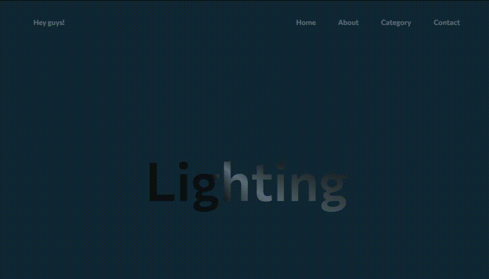
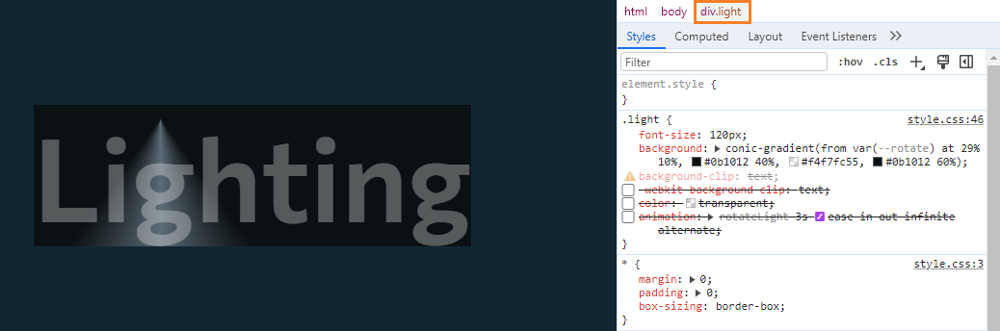
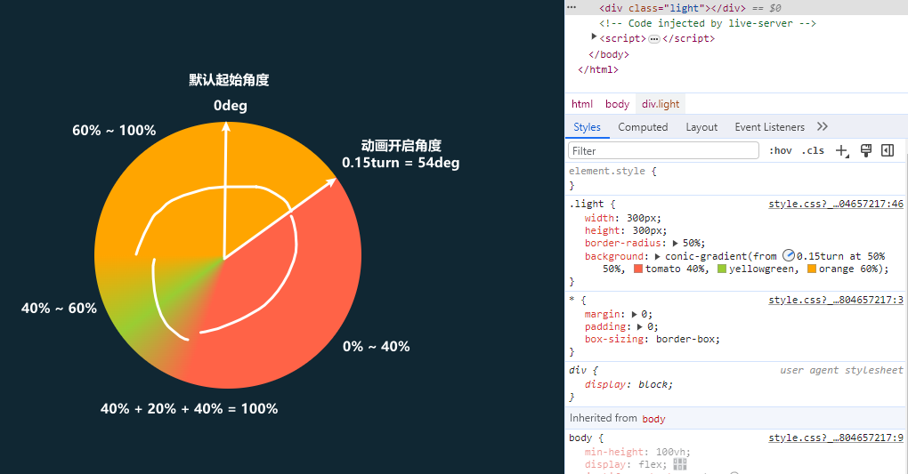

# 「文本灯光」Text文本上的锥形探照灯动画效果

通常网站的标题大多数都是 *静态文字* 展示，为了使标题或`slogan`在网站中脱颖而出，采用独特的方式展示文字是很好办法方式之一。在这篇文章中，将详细介绍使用`HTML`、`CSS`实现 **_文本灯光_**探照灯动画效果，这个动画效果就像是灯在文字上来回探照🔦。使其在页面中成为焦点。[showtime](https://juejin.cn/post/7288963210953850936)！

<p align="center">

</p>

## 涉及属性
简单介绍本案例中使用到的一些`CSS`属性，具体和更详细用法可以点击到`MDN`查看：
* [@propety](https://developer.mozilla.org/zh-CN/docs/Web/CSS/@property)：样式表中注册自定义属性的方式
* [conic-gradient](https://developer.mozilla.org/zh-CN/docs/Web/CSS/gradient/conic-gradient)：创建圆锥形渐变色图像，颜色过渡围绕中线点旋转，而不是从中心向外辐射
* [background-clip](https://developer.mozilla.org/zh-CN/docs/Web/CSS/background-clip)：设置背景(背景图片或颜色)的绘制区域，即控制元素的背景实际显示区域的大小

## HTML结构
HTML代码非常简单，为了更好的展示在网站中的表现添加了一个`<header>`元素用于显示导航栏。真正注意的是类名`light`的`<div>`容器，包裹着需要应用灯光动画的文本内容。
```html
<!DOCTYPE html>
<html lang="en">

<head>
  <meta charset="UTF-8">
  <meta name="viewport" content="width=device-width, initial-scale=1.0">
  <link rel="stylesheet" href="./css/style.css">

  <title>Text Light Animation</title>
</head>

<body>
  <header>
    <div>Hey guys!</div>

    <ul>
      <li>Home</li>
      <li>About</li>
      <li>Category</li>
      <li>Contact</li>
    </ul>
  </header>

  <div class="light">
    Lighting
  </div>
</body>

</html>
```

## CSS样式
接下来，看`CSS`样式表。一些基本的样式重置样式、居中布局、背景字体颜色等不做过多赘述。
* 使用定位把`header`元素固定在页面顶部。
* 使用`@property`规则定义了自定义属性`--rotate`渐变的起始角度，这里用于锥形渐变的起始点。初始值为`0deg`，不继承父元素。
* 使用`conic-gradient`函数给`light`元素应用圆锥渐变的背景：
  - `from 0deg`0度角表示从正上方开始（12点钟方向）。
  - `at`关键字之后是两个百分比值，表示圆锥渐变的中心点在**水平方向**和**垂直方向**上的位置。在这里，渐变的中心点位于元素宽度的`29%`和高度的`10%`处。
  - 渐变的颜色过渡从起始颜色`#0b1012`40%位置开始到`#f4f7fc55`，再回到结束颜色`#0b1012`60%位置开始。
  - `-webkit-background-clip: text`将背景裁剪成为文本内容，使背景只显示在文字区域内部。
  - 将文字颜色设为透明，让背景渐变显示出来。

<p align="center">

</p>

* 最后，定义**无限循环**，并且每次动画迭代之间**交替播放**动画`rotateLight`应用到文字元素上。其中关键帧动画：
  - `turn` 表示完整圆周单位，即`360`度。
  - `from` 将自定义属性的初始值设置为 `0.15turn(0.15 * 360)54度`。
  - `to` 将自定义属性的结束值设置为 `-0.15turn(-0.15 * 360)-54度`。
就这样在动画中，`--rotate` 的值会在初始值和结束值之间循环变化，从而实现灯光来回打照效果。

```css
/* google-fonts */
/* @import url('https://fonts.googleapis.com/css2?family=Commissioner:wght@600&diaplay=swap'); */
@import './fonts-google.css';

* {
  margin: 0;
  padding: 0;
  box-sizing: border-box;
}

body {
  min-height: 100vh;
  display: flex;
  justify-content: center;
  align-items: center;

  background-color: #102733;
  color: #eee5;
  font-family: 'Commissioner', sans-serif;
}

li {
  list-style: none;
}

header {
  position: fixed;
  top: 0;
  left: 0;

  width: 100%;
  height: 100px;
  padding-inline: 100px;
  display: flex;
  justify-content: space-between;
  align-items: center;
}
header ul {
  display: flex;
  column-gap: 50px;
}

@property --rotate {
  syntax: '<angle>';
  inherits: false;
  initial-value: 0deg;
}
.light {
  font-size: 120px;
  background: conic-gradient(from var(--rotate) at 29% 10%, #0b1012 40%, #f4f7fc55, #0b1012 60%);
  background-clip: text;
  -webkit-background-clip: text;
  color: transparent;

  animation: rotateLight 3s ease-in-out infinite alternate;
}
@keyframes rotateLight {
  from {
    --rotate: 0.15turn;
  }

  to {
    --rotate: -0.15turn;
  }
}

```

### 表现


> 相关文章：[CSS巧妙实现元素的流动边框](https://juejin.cn/post/7289072902888177701)

## 最后
通过微妙的背景颜色变化形成光源，然后灯光就像灯塔一样，不断地在文字上扫过，给文字添加了吸引力。无论是作为标题、标语还是突出的文字内容，**灯光动画**都能使其在页面中成为焦点。

希望这篇文章对你在开发类似交互动画效果时有所帮助！如果你对这个案列还有任何问题，欢迎在评论区留言或联系(私信)我。码字不易🥲，不要忘了三连鼓励🤟，谢谢阅读，Happy Coding🎉！

源码我放在了[GitHub](https://github.com/vnyoon/web-magic)，里面还有一些酷炫的效果、动画案列，喜欢的话不要忘了 `starred` 不迷路！
