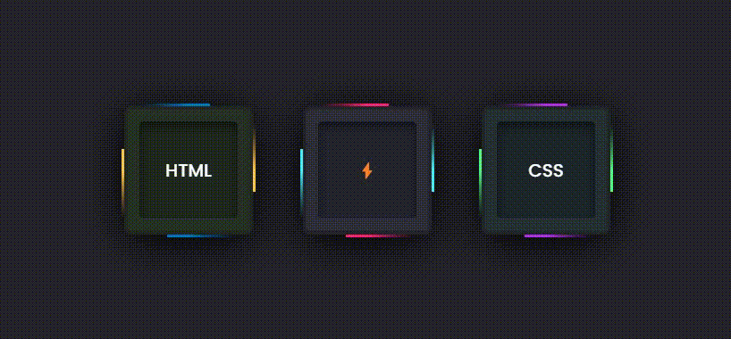
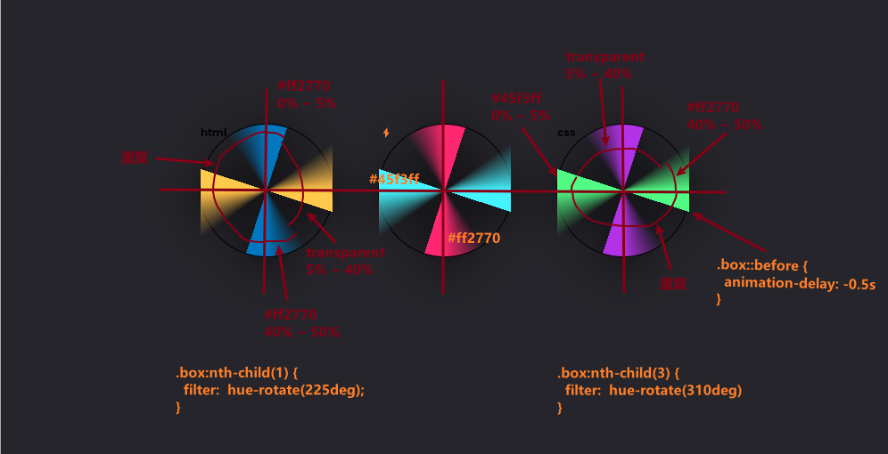
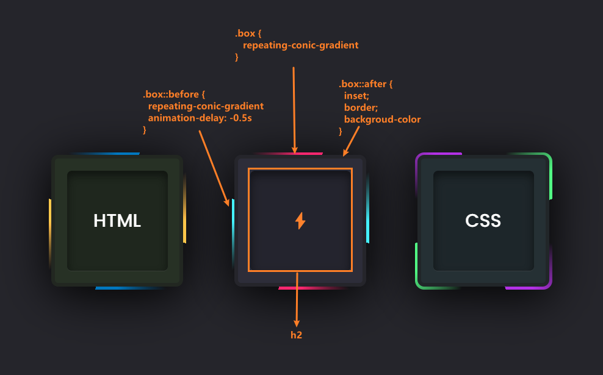

# 「流光边框」CSS巧妙实现元素的流动边框动画效果

本文将详细介绍怎样使用`HTML`和`CSS`一步步来实现 **元素边框无限流动环绕** 动画效果，这个活力十足的动画效果主要通过 *渐变背景* 和 *旋转动画* 来实现，可以给网页中的元素增强活动力🌠。当然每块代码都会有文字描述分析总结，并附图助于理解。[showtime](https://code.juejin.cn/pen/7287522845017440317)！

<p align="center">

</p>

## 涉及属性
简单介绍本案例中使用到的一些`CSS`属性，具体和更详细用法可以点击到`MDN`查看：
* [@propety](https://developer.mozilla.org/zh-CN/docs/Web/CSS/@property)：样式表中注册自定义属性的方式
* [repeating-conic-gradient](https://developer.mozilla.org/en-US/docs/Web/CSS/gradient/repeating-conic-gradient#syntax)：创建一个重复的圆锥渐变色图像，颜色过渡围绕中线点旋转，而不是从中心向外辐射
* [filter](https://developer.mozilla.org/zh-CN/docs/Web/CSS/filter)：改变元素(通常是"img")的外观，添加模糊、阴影、颜色滤镜等效果

## HTML
首先，看`HTML`部分比较简单，只需要在文件中创建三个(数量取决于自己)类名为`box`的`<div>`元素，用于展示内容即可。
```html
<!DOCTYPE html>
<html lang="en">

<head>
  <meta charset="UTF-8">
  <meta name="viewport" content="width=device-width, initial-scale=1.0">
  <link rel="stylesheet" href="./css/style.css">

  <title>Flow Border Animation</title>
</head>

<body>
  <div class="box">
    <h2>html</h2>
  </div>

  <div class="box">
    <h2>⚡</h2>
  </div>

  <div class="box">
    <h2>css</h2>
  </div>
</body>

</html>
```

## CSS
接下来，在`CSS`文件中定义样式一些通用样式和布局方式就不做过多赘述了。从定义了一个CSS自定义属性`--rotate`，用于控制旋转角度，它的初始值为0度。这块开始。
* 每个`.box`元素添加样式，这些box元素就是展示动画的容器。使用`repeating-conic-gradient`实现重复的渐变背景，并通过`filter`设置了阴影效果。同时，使用了`animation`属性来定义旋转动画，先把动画设置为暂停播放。
  - 其中第一个和第三个`.box`使用了不同的滤镜效果，为每个box元素添加了不同的颜色。
* 每个`.box`元素使用`::before`伪类来创建另一个重复渐变背景作为动画效果的一部分，元素的样式与.box元素类似，但动画延迟了0.5秒以表现出错位的效果。



* 然后，给`box`元素和`:before`伪元素添加了鼠标悬停时开始动画运行的样式。
  - `rotating`的关键帧动画从`0%`到`100%`逐渐增加`--rotate`变量的值，使box元素和其伪元素按顺时针方向旋转。持续时间为2秒，并无限循环。
* 最后，给`box`元素添加伪元素`::after`，用于创建边框效果。这个伪元素使用了绝对定位和背景等，盖住box元素和::before伪元素的部分背景以实现最外围流动边框的效果。
```css
/*google-fonts*/
/* @import url('https://fonts.googleapis.com/css?family=Poppins:200,300,400,500,600,700,800,900&display=swap'); */
@import './google-fonts.css';

* {
  margin: 0;
  padding: 0;
  box-sizing: border-box;
  font-family: 'Poppins', sans-serif;
}

body {
  min-height: 100vh;
  background-color: #25252b;

  display: flex;
  flex-wrap: wrap;
  justify-content: center;
  align-items: center;
  gap: 100px;
}

@property --rotate {
  syntax: "<angle>";
  inherits: false;
  initial-value: 0deg;
}

.box {
  position: relative;
  width: 300px;
  height: 300px;

  background: repeating-conic-gradient(
    from var(--rotate),
    #ff2770 0%, 
    #ff2770 5%, 
    transparent 5%, 
    transparent 40%, 
    #ff2770 50%
  );
  border-radius: 20px;

  filter: drop-shadow(0 15px 50px #000);
  animation: rotating 2s linear infinite;
  animation-play-state: paused;
}
.box:nth-child(1) {
  filter: drop-shadow(0 15px 50px #000) hue-rotate(225deg);
}
.box:nth-child(3) {
  filter: drop-shadow(0 15px 50px #000) hue-rotate(310deg);
}

.box::before {
  content: "";
  position: absolute;
  width: 100%;
  height: 100%;
  background: repeating-conic-gradient(
    from var(--rotate), 
    #45f3ff 0%, 
    #45f3ff 5%, 
    transparent 5%, 
    transparent 40%, 
    #45f3ff 50%
  );
  border-radius: 20px;
  animation: rotating 2s linear infinite;
  animation-delay: -0.5s;
  animation-play-state: paused;
}

.box:hover,
.box:hover::before {
  animation-play-state: running;
}
@keyframes rotating { 
  0% {
    --rotate: 0deg;
  }

  100% {
    --rotate: 360deg;
  }
}

.box::after {
  content: "";
  position: absolute;
  inset: 6px;
  border: 8px solid #25252b;
  border-radius: 15px;
  background-color: #2d2d39;
}

.box h2 {
  position: absolute;
  inset: 40px;
  z-index: 10;

  display: flex;
  justify-content: center;
  align-items: center;
  background-color: rgba(0, 0, 0, .2);
  border-radius: 10px;

  color: #fff;
  font-size: 2.5em;
  font-weight: 500;
  text-transform: uppercase;
  box-shadow: inset 0 10px 20px rgba(0, 0, 0, .5);
  border-bottom: 2px solid rgba(255, 255, 255, .1);
}
```

### 渲染


> 相关文章：[Text文本上的锥形探照灯动画效果](https://juejin.cn/post/7288963210953850936)


## 最后
通过本篇文章的详细介绍，相信能够帮助你更好地使用`CSS`来创建一个**流动边框**动画，从而理解掌握和应用这个效果，为你的网页添加一些吸引力。

希望这篇文章对你在开发类似交互动画效果时有所帮助！如果你对这个案列还有任何问题，欢迎在评论区留言或联系(私信)我。码字不易🥲，不要忘了三连鼓励🤟，谢谢阅读，Happy Coding🎉！

源码我放在了[GitHub](https://github.com/vnyoon/web-magic)，里面还有一些酷炫的效果、动画案列，喜欢的话不要忘了 `starred` 不迷路！
