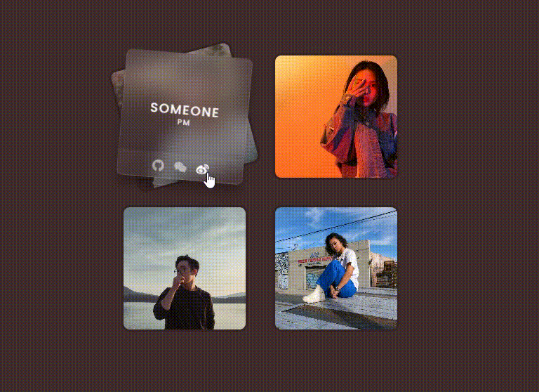
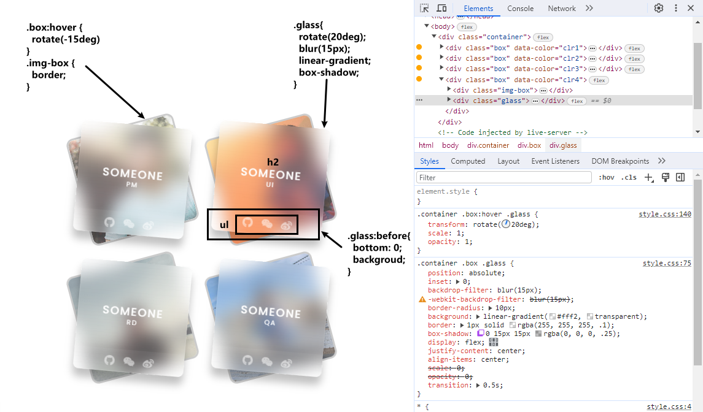

# CSS轻松实现玻璃拟态质感的卡片与:has()选择器

本篇文章中，将详细介绍使用`HTML`、`CSS`实现**玻璃质感卡片悬停效果**的技术，当鼠标悬停在图片上时，会渐变显示出现一个**玻璃拟态风格的卡片**元素，其中展示了更多的内容，同时页面背景颜色也会相对变化。这种朦胧的效果可以让网页在用户与鼠标交互时展现出层次感与空间感🪟。[showtime](https://code.juejin.cn/pen/7287522845017440317)！

玻璃拟态具有不限以下几个显著的特征，本文实现的效果也是围绕这几点展开的：
- 背景模糊磨砂玻璃的透明度效果
- 悬浮在元素上的漂浮层级
- 突出整体效果的鲜艳色彩元素
- 让形状质感从背景脱颖而出的浅色边框

<p align=center>

</p>

## 首先 HTML
看`HTML`部分：
* 每个卡片(个人介绍)由`.box`的容器元素组成，其中的`data-color`属性用于设置页面的背景颜色，几张卡片分别对应几种不同的颜色。
* 卡片容器内主要是由两个部分组成，一个是个人图片容器(`.img-box`)和另一个玻璃卡片容器(`.glass`)。
```html
<!DOCTYPE html>
<html lang="en">

<head>
  <meta charset="UTF-8">
  <meta name="viewport" content="width=device-width, initial-scale=1.0">
  <link rel="stylesheet" href="./css/style.css">
  <link rel="stylesheet" href="//at.alicdn.com/t/c/font_4280110_inbokro5w8o.css">

  <title>Glassmorphism Cards Hover Effects</title>
</head>

<body>
  <div class="container">
    <div class="box" data-color="clr1">
      <div class="img-box">
        
      </div>

      <div class="glass">
        <h2>
          Someone
          <br>
          <span>PM</span>
        </h2>

        <ul>
          <a href="#">
            <i class="iconfont icon-GitHub"></i>
          </a>
          <a href="#">
            <i class="iconfont icon-weixin"></i>
          </a>
          <a href="#">
            <i class="iconfont icon-weibo"></i>
          </a>
        </ul>
      </div>
    </div>

    <!-- 同样的结构重复三次，注意自定义数据属性的值不同和图片、角色不同 -->
    <div class="box" data-color="clr2"> </div>
    <div class="box" data-color="clr3"> </div>
    <div class="box" data-color="clr4"> </div>
  </div>
</body>

</html>
```

## 接下来 CSS
看`CSS`部分，一些基本的样式重置样式、居中布局、背景字体颜色等不做过多介绍。主要看实现玻璃效果和动态悬停等效果的代码及其描述：
* 使用`:has()`(伪类选择器)设置了鼠标移入`.box`卡片容器时，页面背景颜色改变。
  - 它通过()里面的元素确定外面的元素的CSS样式。
  - 所以当`body`中有`.box`容器时元素具有属性`data-color="clr1/2/3/4"`并且处于`:hover`状态选中`body`，随后设置样式(背景色)。
  - 目前*火狐浏览器*不支持该选择器。
```css
/* @import url('https://fonts.googleapis.com/css?family=Poppins:200,300,400,500,600,700,800,900&display=swap'); */
@import './google-fonts.css';

* {
  margin: 0;
  padding: 0;
  box-sizing: border-box;
  font-family: 'Poppins', sans-serif;
}

img {
  width: 100%;
  height: 100%;
  object-fit: cover;
}

a {
  text-decoration: none;
  color: #fff8;
}

body {
  min-height: 100vh;
  display: flex;
  justify-content: center;
  align-items: center;

  background-color: #111;
  transition: background-color .5s;
}
body:has(.box[data-color="clr1"]:hover) {
  background-color: #412c2d;
}
body:has(.box[data-color="clr2"]:hover) {
  background-color: #45342a;
}
body:has(.box[data-color="clr3"]:hover) {
  background-color: #253c3f;
}
body:has(.box[data-color="clr4"]:hover) {
  background-color: #27313f;
}

```
* 使用定位把`.glass`放在图片上方后，设置`backdrop-filter: blur()`属性把背景模糊实现玻璃效果，
设置`linear-gradient`背景渐变色提升玻璃的亮度，设置浅色边框添加质感与淡色阴影提升形状突出漂浮层级。
* 注意在`.container`中设置了`overflow: hidden;`是防止小屏时鼠标移入图片和玻璃旋转导致整体宽度扩大，可能会导致换行，移出又回到原来行，闪现问题和横向滚动条问题。
* 当鼠标悬浮`.box`时，降低了图片的透明度突出磨砂玻璃卡片，但不能降太低那样就显的玻璃无亮度了。
* 最后就是给`.glass`设置旋转错位，过渡动画实现了渐变显示的效果。增强卡片在页面的视觉效果。
```css
.container {
  display: flex;
  flex-wrap: wrap;
  justify-content: center;
  align-items: center;
  gap: 40px;
  padding: 40px;
  overflow: hidden;
}

.container .box {
  position: relative;

  width: 200px;
  height: 200px;
  display: flex;
  justify-content: center;
  align-items: center;
  transition: transform .5s;
}

.container .box .img-box {
  position: absolute;
  inset: 0;
  border: 4px solid rgba(0, 0, 0, .2);
  border-radius: 13px;
}
.container .box .img-box img {
  border-radius: 10px;
  transition: opacity 0.5s;
}

.container .box .glass {
  position: absolute;
  inset: 0;
  backdrop-filter: blur(15px);
  -webkit-backdrop-filter: blur(15px); /* for safari */
  border-radius: 10px;
  background: linear-gradient(#fff2, transparent);
  border: 1px solid rgba(255, 255, 255, .1);
  box-shadow: 0 15px 15px rgba(0, 0, 0, .25); 

  display: flex;
  justify-content: center;
  align-items: center;
  scale: 0;
  opacity: 0;
  transition: 0.5s;
}
.container .box .glass::before {
  content: "";
  position: absolute;
  bottom: 0;

  width: 100%;
  height: 40px;
  background-color: rgba(255, 255, 255, 0.05);
}

.container .box .glass h2 {
  font-size: 1.25em;
  color: #fff;
  font-weight: 500;
  text-transform: uppercase;
  letter-spacing: .1em;
  text-align: center;
  line-height: 0.8em;
}
.container .box .glass h2 span {
  font-size: 0.5em;
  font-weight: 400;
}

.container .box .glass ul { 
  position: absolute;
  bottom: 5px;
  
  width: 100%;
  display: flex;
  justify-content: center;
  gap: 15px;
}
.container .box .glass ul a { 
  transition: color 0.3s;
}
.container .box .glass ul a:hover { 
  color: #fff;
}
.container .box .glass ul i { 
  font-size: 1.25em;
}

.container .box:hover {
  transform: rotate(-15deg);
}
.container .box:hover .img-box img {
  opacity: .6;
}
.container .box:hover .glass {
  transform: rotate(20deg);
  scale: 1;
  opacity: 1;
}

```

### 表现


> 相关文章：[CSS创作个人主页介绍卡片](https://juejin.cn/post/7260709771870060603)

## 最后
通过`HTML`和`CSS`实现一个具有**玻璃质感的卡片**悬停效果。这种玻璃拟态风格的特征显著，用户也能快速确定界面的层次结构和深度。画面中清晰显著的则是最迫切想要表达的重点，非常好辨认。或者你也可以根据自己的需求进行调整，进一步改善和扩展这个效果。

希望这篇文章对你在开发类似交互动画效果时有所帮助！如果你对这个案列还有任何问题，欢迎在评论区留言或联系(私信)我。码字不易🥲，不要忘了三连鼓励🤟，谢谢阅读，Happy Coding🎉！

源码我放在了[GitHub](https://github.com/vnyoon/web-magic)，里面还有一些酷炫的效果、动画案列，喜欢的话不要忘了 `starred` 不迷路！
