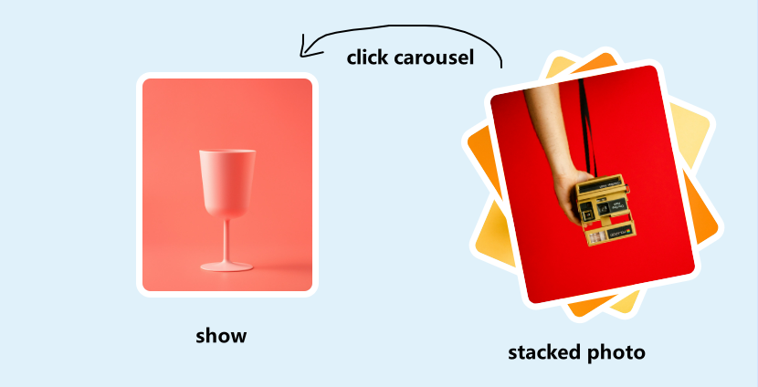

# 「堆叠照片」张张都是焦点的轮播图片效果

本文将介绍如何使用`HTML`、`CSS`、`JavaScript`实现一个 **堆叠照片轮播图片** 动画效果。这个轮播图片效果最初是几张图片都以堆叠的方式展示，当用户通过点击某张图片时，会使其平滑移到左侧并旋转展示全貌，在`1s`后图片会自动回到原处并旋转，同时层级降低依次堆到其它图片背后，最终形成一种堆叠交错的效果🥪。[showtime](https://code.juejin.cn/pen/7291167808094732345)

<p align=center>

</p>

**<p align=center>为了更好的展示预览，码金里面的代码做了小调整。</p>**

## 构建 HTML
首先，构建`HTML`，创建了类名为`.galleries`的`<div>`容器，用于包裹整个堆叠照片轮播部分。
* 内部有四个具有类名`.image-box`的`<div>`元素(应用旋转、平移)，它们是用来包裹显示``图片的。
```html
<!DOCTYPE html>
<html lang="en">

<head>
  <meta charset="UTF-8">
  <meta name="viewport" content="width=device-width, initial-scale=1.0">
  <link rel="stylesheet" href="./index.css">

  <title>Stacked Photo Carousel</title>
</head>

<body>
  <div class="galleries">
    <div class="image-box">
      
    </div>

    <div class="image-box">
      
    </div>

    <div class="image-box">
      
    </div>

    <div class="image-box">
      
    </div>
  </div>

  <script src="./index.js"></script>
</body>

</html>
```

## 添加 CSS
接下来，看`CSS`主要部分样式的代码：
* `.image-box`元素通过设置 **定位** 先把每张图片堆叠在一起，距离顶部和右侧一定距离。
  - 第一个和第二个元素，通过设置一定旋转角度错位展示爆露出所有让用户可以点击到每一张，同时给露出一角的图片保持了神秘感。
```css
* {
  margin: 0;
  padding: 0;
  box-sizing: border-box;
}

body {
  background-color: #e0f1fa;
}

.image-box {
  position: absolute;
  top: 10rem;
  right: 10rem;

  width: 400px;
}
.image-box:first-child {
  transform: rotate(23deg);
}
.image-box:nth-child(2) {
  transform: rotate(328deg);
}
.image-box:nth-child(3) {
  transform: rotate(169deg);
}

.image-box .image {
  width: 100%;
  display: block;
  border: 1rem solid #fff;
  border-radius: 2rem;
  cursor: pointer;
  user-select: none;
}


@media screen and (max-width: 768px) {
  html {
    font-size: 5px;
  }
  
  .image-box {
    width: 150px;
  }
}

```
> 多数样式单位使用的是`rem`，为了方便展示预览做适配台调整。你可以根据实际情况然后使用什么单位取决于你的案列。

## 编写 JavaScript
随后，看`JavaScript`代码添加交互，每个`.image-box`元素添加了一个点击事件监听器。当用户点击某个图片容器时，触发该事件：
1. `zIndex`变量递增`1`，用于控制图片的层叠顺序(点击的那张图片总是展示在最上面)。
2. 修改被点击的图像容器的样式属性，包括将其距离右侧距离增大(向左移动)、设置经过递增后新的`zIndex`值、旋转到0度（`rotate(0deg)`）板板正正的展示，并添加过渡效果`0.3s`使平滑过渡到目标状态，接着就会有从倾斜旋转到正值的动画了。
3. 使用`setTimeout`函数设置一些延迟操作，在`1秒`后执行以下步骤：
  - 通过减去`3`，将`zIndex`变量值变小，以便后续图片容器可以按正确的顺序叠放(最先点击的那张图片总是展示在最下方)。
  - 将被点击的图像容器的样式属性还原为初始状态，再次使用`setTimeout`函数，在`300毫秒`后将`transition`属性设置为空。
```js
const imgElements = document.querySelectorAll('.image-box');

let zIndex = 1;

imgElements.forEach(ele => {
  ele.addEventListener("click", () => {
    zIndex++;
    
    ele.style.right = "50rem";
    ele.style.zIndex = zIndex;
    ele.style.transform = "rotate(0deg)";
    ele.style.transition = "all 0.3s";

    console.log(zIndex);
    setTimeout(() => {
      zIndex -= 3;
 
      ele.style.right = "";
      ele.style.zIndex = zIndex;
      ele.style.transform = ""; 

      setTimeout(() => {
        ele.style.transition = "";
      }, 300);
    }, 1000);
  });
});
```
通过这些操作后，可以做到**堆叠照片轮播**的效果。当用户点击某个图像容器时，该容器会被移动到最前面并旋转为0度，然后在一定时间后回到原始位置(其它图片的最下方)，让下一个图像容器出现在最前面。

## 关于
`transform: rotate()`属性定义元素旋转**动画效果**文章：
* [点亮网页的星星粒子动画效果🌟](https://juejin.cn/post/7291564831710543926)
* [CSS轻松实现玻璃拟态质感的卡片与:has()选择器🪟](https://juejin.cn/post/7290017749714092072)

## 最后
通过本文详细的介绍，实现了一种**堆叠照片轮播图片**动画效果，在点击时改变图片的位置和样式，实现了堆叠效果，当选择不同的图片时，它们会被重新堆叠起来，形成新的顺序。整体的效果实现还是比较简单的，但有一些细节是可选的，比如把旋转角度设置过大，当点击展示与回到原处时会有一个旋转动画，使其表现上更具备活动力。或者你也可以根据自己的需求进行调整，进一步改善和扩展这个效果。

希望这篇文章对你在开发类似交互动画效果时有所帮助！如果你对这个案列还有任何问题，欢迎在评论区留言或联系(私信)我。码字不易🥲，不要忘了三连鼓励🤟，谢谢阅读，Happy Coding🎉！

源码我放在了[GitHub](https://github.com/vnyoon/web-magic)，里面还有一些酷炫的效果、动画案列，喜欢的话不要忘了 `starred` 不迷路！
