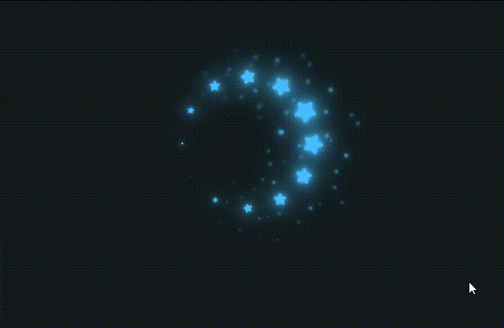
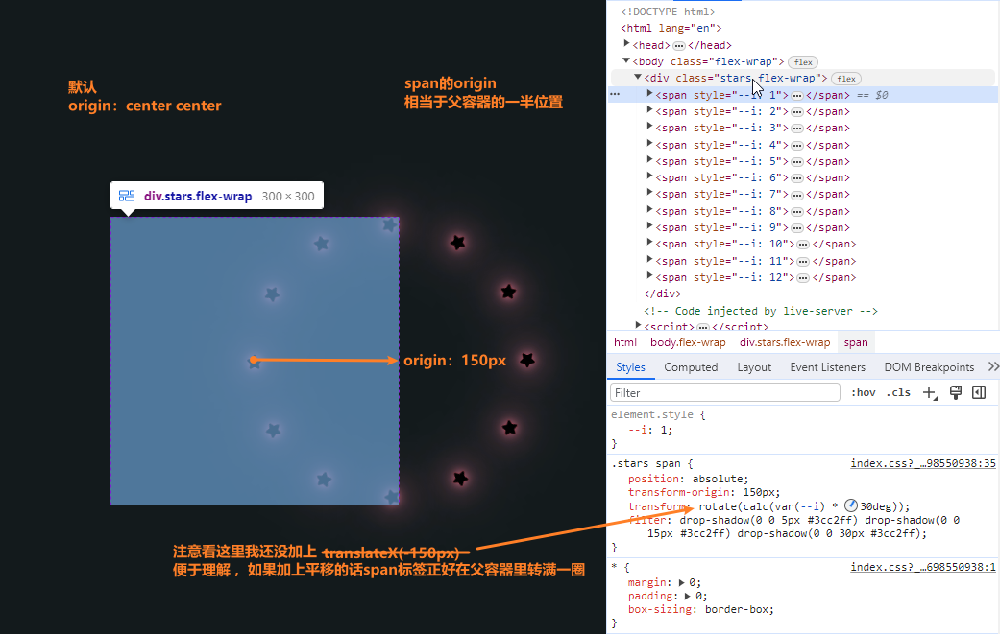
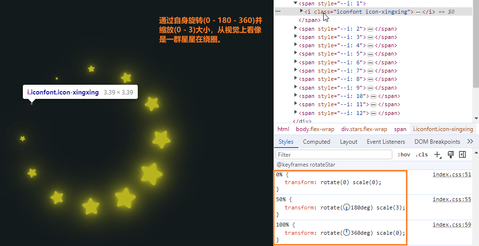
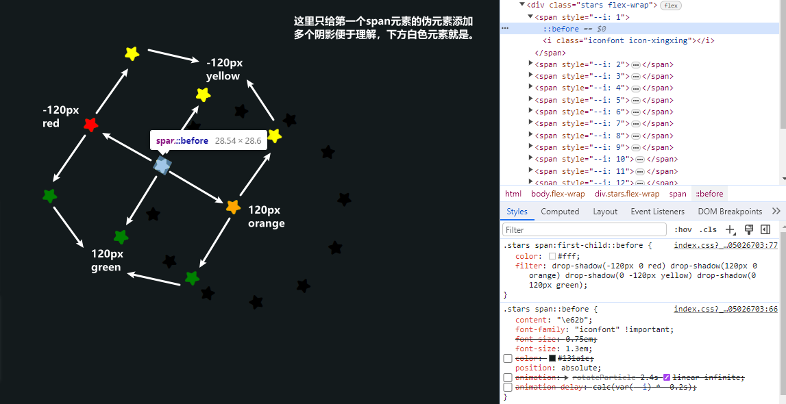

# 点亮网页的星星粒子动画效果

在本篇文章中，介绍如何使用`HTML`、`CSS`实现一个**华丽的星星粒子**动画效果。这个效果会呈现**一群颜色不断变化的星星**会逐渐旋转从无到变大再到消失的状态，在页面中呈现出闪耀的星星。同时每颗星星周围会有数个粒子状的小星星环绕，粒子也会伴随着星星启动动画逐渐从无到有等，一系列的动画展现出更具活力的视觉效果🌟。[showtime](https://code.juejin.cn/pen/7291597240743755831)！

<p align=center>

</p>

## 构建HTML
`HTML`结构非常简单，一个类名为`.stars`的`<div>`元素，整个动画效果就在这个元素里面完成的。
* 该元素内部包含多个**星星**元素(`<span>`)。
* 一共是`12`颗星星。数量将决定怎么旋转，具体看后面CSS。
* span元素内部就是包裹的星星图标了。

这里不要忘记引入外部图标库以及CSS文件:
```html
<!DOCTYPE html>
<html lang="en">

<head>
  <meta charset="UTF-8">
  <meta name="viewport" content="width=device-width, initial-scale=1.0">

  <link rel="stylesheet" href="//at.alicdn.com/t/c/font_4293613_mrpggi3rv8h.css">
  <link rel="stylesheet" href="./index.css">
  
  <title>Star Particles</title>
</head>

<body class="flex-wrap">
  <div class="stars flex-wrap">
    <span style="--i: 1">
      <i class="iconfont icon-xingxing"></i>
    </span>

    <span style="--i: 2">
      <i class="iconfont icon-xingxing"></i>
    </span>

    <span style="--i: 3">
      <i class="iconfont icon-xingxing"></i>
    </span>

    <span style="--i: 4">
      <i class="iconfont icon-xingxing"></i>
    </span>

    <span style="--i: 5">
      <i class="iconfont icon-xingxing"></i>
    </span>

    <span style="--i: 6">
      <i class="iconfont icon-xingxing"></i>
    </span>

    <span style="--i: 7">
      <i class="iconfont icon-xingxing"></i>
    </span>

    <span style="--i: 8">
      <i class="iconfont icon-xingxing"></i>
    </span>

    <span style="--i: 9">
      <i class="iconfont icon-xingxing"></i>
    </span>

    <span style="--i: 10">
      <i class="iconfont icon-xingxing"></i>
    </span>

    <span style="--i: 11">
      <i class="iconfont icon-xingxing"></i>
    </span>

    <span style="--i: 12">
      <i class="iconfont icon-xingxing"></i>
    </span>
  </div>
</body>

</html>
```

## 添加CSS
下面将通过具体的`CSS`样式来一步步实现动画效果。重置样式后通过一个`.flex-wrap`类名把页面布局做成水平垂直居中。

### 静态旋转
* 通过关键帧动画给`.stars`元素添加滤镜(`filter: hue-rotate()`)应用色相旋转(0 ~ 360)deg。
* 由于`rotate()`函数的转换原点是旋转中心改变，所以这里改变`span`元素的原点，再旋转自身通过元素的自定义属性计算角度，使其刚好旋转一周(360deg)即可。
  - 当前是：12span * 30deg = 360deg。可以根据实际情况计算，例如10个span的话就是：10span * 36deg = 360deg。
* 随后设置元素的轮廓生成多个阴影`drop-shadow()`的效果。值越大，阴影就越大，也越模糊。
```css
* {
  margin: 0;
  padding: 0;
  box-sizing: border-box;
}

.flex-wrap {
  display: flex;
  justify-content: center;
  align-items: center;
}

body {
  min-height: 100vh;
  background-color: #131a1c;
}

.stars {
  position: relative;

  width: 300px;
  height: 300px;
  animation: animateColor 7.2s linear infinite;
}
@keyframes animateColor {
  0% {
    filter: hue-rotate(0);
  }

  100% {
    filter: hue-rotate(360deg)
  }
}

.stars span {
  position: absolute;
  
  transform-origin: 150px;
  transform: translateX(-150px) rotate(calc(var(--i) * 30deg));
  filter: drop-shadow(0 0 5px #3cc2ff) drop-shadow(0 0 15px #3cc2ff) drop-shadow(0 0 30px #3cc2ff);
}
```
#### 表现


> 滤镜转换的颜色同样会应用在阴影上，此时`span`元素的阴影已经是不断在变化颜色了，由于我没放`gif`，所以体现不出来。

### 动态转动
通过使用关键帧动画，给星星图标添加动画使其不断的旋转并且大小也会跟随着变化，像是转动起来了一样。
* 给每个`i`标签都添加了延迟执行动画的时间，依次是`-0.2s ~ -2.4s`，突出了元素接连的动画效果。
```css
.stars span i {
  position: relative;
  display: block;
  color: #3cc2ff;
  
  animation: rotateStar 2.4s linear infinite;
  animation-delay: calc(var(--i) * -0.2s);
}
@keyframes rotateStar {
  0% {
    transform: rotate(0) scale(0);
  }

  50% {
    transform: rotate(180deg) scale(3);
  }

  100% {
    transform: rotate(360deg) scale(0);
  }
}
```
#### 表现


### 点缀粒子
通过每个span元素的**伪元素**来实现环绕在每颗星星周围的粒子。这些粒子是通过给伪元素设置**多个阴影值**形成的，同时也会产生动画(从透明接着逐渐旋转出现再旋转逐渐消失)。
```css
.stars span::before {
  content: "\e62b";
  font-family: "iconfont";
  font-size: 0.75em;
  color: #131a1c;
  position: absolute;

  animation: rotateParticle 2.4s linear infinite;
  animation-delay: calc(var(--i) * -0.2s);
}
@keyframes rotateParticle {
  0% {
    scale: 1;
    opacity: 0;
    rotate: 0;
  }

  50% {
    scale: 1;
    opacity: 1;
    rotate: 180deg;
  }

  100% {
    scale: 0;
    opacity: 0;
    rotate: 360deg;
    filter: drop-shadow(-150px 0 #3cc2ff) drop-shadow(150px 0 #3cc2ff) drop-shadow(0 -150px #3cc2ff) drop-shadow(0 150px #3cc2ff);
  }
}

```
#### 表现


### 关于
`filter: hue-rotate()`属性设置元素颜色**动画效果**文章：
* [CSS巧妙实现元素的流动边框动画](https://juejin.cn/post/7289072902888177701)
* [Input输入框上的占位文本动画效果](https://juejin.cn/post/7278238985453731874)

## 最后
通过本篇文章的详细介绍，相信能够帮助你更好地使用`CSS`来创建一个**漂亮的星星粒子**动画，从而理解掌握和应用这个效果。其中的过渡效果带来一种平滑和流畅的感觉，通过逐渐显示和颜色渐变，为网站提供了更加生动、有趣的体验。

希望这篇文章对你在开发类似交互动画效果时有所帮助！如果你对这个案列还有任何问题，欢迎在评论区留言或联系(私信)我。码字不易🥲，不要忘了三连鼓励🤟，谢谢阅读，Happy Coding🎉！

源码我放在了[GitHub](https://github.com/vnyoon/web-magic)，里面还有一些酷炫的效果、动画案列，喜欢的话不要忘了 `starred` 不迷路！
