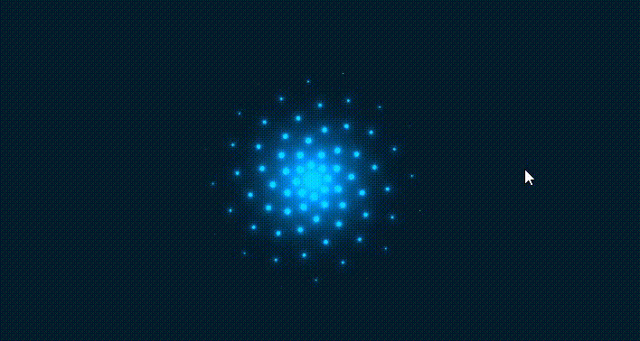

# 很酷的CSS Loading动画，让网页加载更有趣

当用户正在浏览网站网页时，为了更好的用户体验，经常会使用 **加载中** 文字或者动画来表示正在 *加载数据* 或 *执行某项操作*。而使用动画不仅能够吸引用户的注意力，同时也能够传达信息"系统正在工作中"，需要一些时间来完成任务。本文将详细介绍如何通过`CSS`创建一个**加载中**动画效果🦚。[showtime](https://code.juejin.cn/pen/7296671388177203215)！

<p align=center>

</p>

## HTML 结构
首先是`HTML`代码，定义了一个类名`container`的`<div>`容器：
* 在这个容器里面包含了一些加载器`.loader`，每个加载器都具有不同的旋转角度自定义属性`--r(1~4)`，而每个加载器里面有`20`个`<span>`元素，并且也都具有不同的旋转角度自定义属性`--r(1~20)`。
* 后面会通过CSS设置不同的旋转角度属性`--r`和旋转角度子属性`--i`，创建多个加载器，并且每个加载器都具有不同的动画表现。
```html
<!DOCTYPE html>
<html lang="en">

<head>
  <meta charset="UTF-8">
  <meta name="viewport" content="width=device-width, initial-scale=1.0">
  <title>CSS Animation</title>

  <link rel="stylesheet" href="./index.css">
</head>

<body>
  <div class="container">
    <div class="loader" style="--r: 1">
      <span style="--i: 1"></span>
      <span style="--i: 2"></span>
      <span style="--i: 3"></span>
      <span style="--i: 4"></span>
      <span style="--i: 5"></span>
      <span style="--i: 6"></span>
      <span style="--i: 7"></span>
      <span style="--i: 8"></span>
      <span style="--i: 9"></span>
      <span style="--i: 10"></span>
      <span style="--i: 11"></span>
      <span style="--i: 12"></span>
      <span style="--i: 13"></span>
      <span style="--i: 14"></span>
      <span style="--i: 15"></span>
      <span style="--i: 16"></span>
      <span style="--i: 17"></span>
      <span style="--i: 18"></span>
      <span style="--i: 19"></span>
      <span style="--i: 20"></span>
    </div>

    <div class="loader" style="--r: 2">
      <span style="--i: 1"></span>
      <span style="--i: 2"></span>
      <span style="--i: 3"></span>
      <span style="--i: 4"></span>
      <span style="--i: 5"></span>
      <span style="--i: 6"></span>
      <span style="--i: 7"></span>
      <span style="--i: 8"></span>
      <span style="--i: 9"></span>
      <span style="--i: 10"></span>
      <span style="--i: 11"></span>
      <span style="--i: 12"></span>
      <span style="--i: 13"></span>
      <span style="--i: 14"></span>
      <span style="--i: 15"></span>
      <span style="--i: 16"></span>
      <span style="--i: 17"></span>
      <span style="--i: 18"></span>
      <span style="--i: 19"></span>
      <span style="--i: 20"></span>
    </div>

    <div class="loader" style="--r: 3">
      <span style="--i: 1"></span>
      <span style="--i: 2"></span>
      <span style="--i: 3"></span>
      <span style="--i: 4"></span>
      <span style="--i: 5"></span>
      <span style="--i: 6"></span>
      <span style="--i: 7"></span>
      <span style="--i: 8"></span>
      <span style="--i: 9"></span>
      <span style="--i: 10"></span>
      <span style="--i: 11"></span>
      <span style="--i: 12"></span>
      <span style="--i: 13"></span>
      <span style="--i: 14"></span>
      <span style="--i: 15"></span>
      <span style="--i: 16"></span>
      <span style="--i: 17"></span>
      <span style="--i: 18"></span>
      <span style="--i: 19"></span>
      <span style="--i: 20"></span>
    </div>

    <div class="loader" style="--r: 4">
      <span style="--i: 1"></span>
      <span style="--i: 2"></span>
      <span style="--i: 3"></span>
      <span style="--i: 4"></span>
      <span style="--i: 5"></span>
      <span style="--i: 6"></span>
      <span style="--i: 7"></span>
      <span style="--i: 8"></span>
      <span style="--i: 9"></span>
      <span style="--i: 10"></span>
      <span style="--i: 11"></span>
      <span style="--i: 12"></span>
      <span style="--i: 13"></span>
      <span style="--i: 14"></span>
      <span style="--i: 15"></span>
      <span style="--i: 16"></span>
      <span style="--i: 17"></span>
      <span style="--i: 18"></span>
      <span style="--i: 19"></span>
      <span style="--i: 20"></span>
    </div>
  </div>
</body>

</html>
```

## CSS 样式
接下来看`CSS`代码，重置全局样式后，给`.container`元素定义了水平垂直居中布局，然后使用`filter`样式属性来应用色相旋转(`hue-rotate`)滤镜，将背景色调整为`90度`的色相。因此，子元素的任何颜色同样会天剑滤镜。
* 首先，每个`.loader`元素通过`transform: rotate()`属性根据`--r`值设置旋转角度 **(45deg * 1/2/3/4 = 45/90/135/180deg)**。
* 其次，每个`span`元素使用定位设置初始位置在左侧，以及通过`transform: rotate()`属性根据`--i`值设置旋转角度 **(18deg * 1~20 = 18 ~ 360deg)**。
* 然后，每个`span::before`定义固定的宽度和高度及背景颜色。使用`box-shadow`属性定义了一个由**多个投影**组成的阴影效果，产生一种立体感。
```css
* {
  margin: 0;
  padding: 0;
  box-sizing: border-box;
}

.container {
  min-height: 100vh;
  background-color: #042104;
  filter: hue-rotate(90deg);

  display: flex;
  justify-content: center;
  align-items: center;
}

.loader {
  position: relative;
  transform: rotate(calc(var(--r) * 45deg));
}

.loader span {
  position: absolute;
  top: 0;
  left: -200px;

  width: 200px;
  height: 2px;
  transform-origin: right;
  transform: rotate(calc(var(--i) * 18deg));
}

.loader span::before {
  content: "";
  display: block;

  width: 15px;
  height: 15px;
  background-color: #00ff0a;
  border-radius: 15px;
  box-shadow: 0 0 10px #00ff0a, 
              0 0 20px #00ff0a, 
              0 0 40px #00ff0a, 
              0 0 60px #00ff0a, 
              0 0 80px #00ff0a, 
              0 0 100px #00ff0a;

  animation: animate 5s linear infinite;
  animation-delay: calc(-0.5s * var(--i));
}
@keyframes animate {
  0% {
    transform: translateX(200px) scale(1);
    opacity: 0;
  }

  10% {
    opacity: 1;
  }

  80% {
    opacity: 1;
  }

  100% {
    transform: translateX(0) scale(0);
    opacity: 1;
  }
}

```
此外，通过`animation`属性和`@keyframes`规则，定义了名为`animate`的关键帧动画。该动画在`5`秒内线性地进行，无限循环播放。动画的每个关键帧设置了不同的变换效果，包括 **平移、缩放和透明度** 变化。根据时间的进展，加载器的形状和位置会发生变化，从而创造出动态的效果。

## 相关效果
### 旋转函数：
* [一切尽在CSS制作卡牌悬停动画效果之中]()
* [「堆叠照片」张张都是焦点的轮播图片效果](https://juejin.cn/post/7291125585668341760)
* [CSS轻松实现玻璃拟态质感的卡片与:has()选择器](https://juejin.cn/post/7290017749714092072)

### 色相旋转：
* [点亮网页的星星粒子动画效果](https://juejin.cn/post/7291564831710543926)
* [「流光边框」CSS巧妙实现元素的流动边框动画](https://juejin.cn/post/7289072902888177701)
* [Input输入框上的占位文本动画效果〰️](https://juejin.cn/post/7278238985453731874)

## 最后
通过本篇文章的详细介绍，相信能够帮助你更好地使用`CSS`来创建一个**loading**加载中动画，从而理解掌握和应用这个效果。你可以根据自己的需求调整大小、颜色和持续时间等参数，创建符合你网页风格的加载中动画。加载中动画不仅能够提供视觉上的反馈，告诉用户系统正在工作中，还能够改善用户体验，减少长时间等待的焦虑感。

希望这篇文章对你在开发类似交互动画效果时有所帮助！如果你对这个案列还有任何问题，欢迎在评论区留言或联系(私信)我。码字不易🥲，不要忘了三连鼓励🤟，谢谢阅读，Happy Coding🎉！

源码我放在了[GitHub](https://github.com/vnyoon/web-magic)，里面还有一些酷炫的效果、动画案列，喜欢的话不要忘了 `starred` 不迷路！
