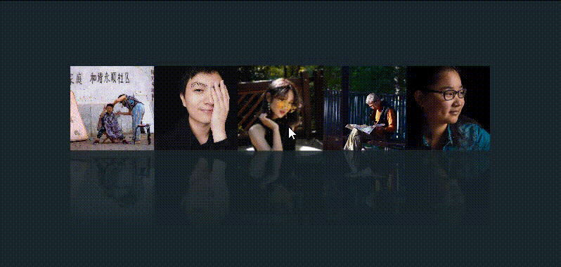
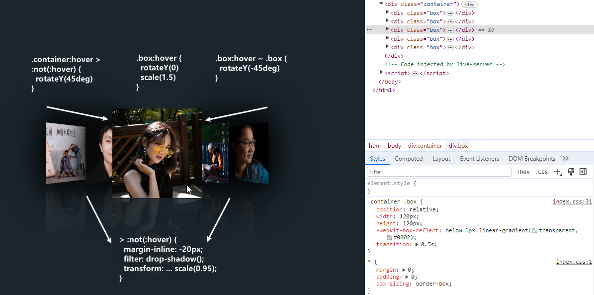

# CSS选择器创建从平凡到立体的3D独特视觉效果

## 前面
本文将详细介绍如何通过巧妙地运用`HTML`和`CSS`实现图片**3D鼠标悬停效果**。这个效果是当鼠标悬浮在元素上时，当前元素放大展示，其它元素内扣折叠并缩小，以突出想要浏览查看的元素。为网页中的元素赋予**立体感**，并在用户与页面元素交互时呈现出非常有趣的效果💥。

本案例中的实现仅依靠 `CSS` 的 **选择器** 和 **过渡动画** 和 **旋转属性** 就能达成的效果，所以无论你是初学者还是有经验的开发者，都能轻松地理解和应用这个3D鼠标悬停效果。开始之前，请确保准备好一个包含所需图片资源的文件夹，让我们一起来实现这个令人心动的 3D 鼠标悬停效果吧🚀！

<p align=center>

</p>

## HTML 结构
首先，看 `HTML` 代码部分比较简单，定义了一个包含多个盒子(`.box`)的容器(`.container`)。而每个盒子都只有一个 `` 元素显示图片。最终的效果是在 `container` 元素中的。
```html
<!DOCTYPE html>
<html lang="en">

<head>
  <meta charset="UTF-8">
  <meta name="viewport" content="width=device-width, initial-scale=1.0">
  <title>CSS 3D Hover Effects</title>

  <link rel="stylesheet" href="./index.css">
</head>

<body>
  <div class="container">
    <div class="box">
      
    </div>

    <div class="box">
      
    </div>

    <div class="box">
      
    </div>

    <div class="box">
      
    </div>

    <div class="box">
      
    </div>
  </div>
</body>

</html>
```

## CSS 样式
接下来，看 `CSS` 部分的代码，一些基本的样式重置 & 颜色调整 & 布局排版不做过多介绍了。
```css
* {
  margin: 0;
  padding: 0;
  box-sizing: border-box;
}

img {
  width: 100%;
  height: 100%;
  object-fit: cover;
}

body {
  min-height: 100vh;
  background-color: #1a252c;
  display: flex;
  justify-content: center;
  align-items: center;
  overflow-x: hidden;
}
```
主要的样式部分代码不多，下面是一些关键样式的解释代码如下：
* `.container`容器，使用 flexbox 将其中的 `.box` 元素水平和垂直居中与换行，应用保留 `3D` 布局的变换样式。
* `.box`容器，定义了每个盒子的宽度和高度，并使用 `-webkit-box-reflect` 属性创建了一个透明的投影效果并为鼠标悬停设置了过渡动画`0.5s`。
* `.container:hover > :not(:hover)` 选择器表示当鼠标悬停在容器上时，除了当前悬停的元素外，其它元素设置负的内联边距(水平方向上)，创建重叠效果。添加两个投影滤镜，产生了投影效果。并在 3D 空间中实现透视效果、沿 `Y`(垂直) 轴旋转 `45` 度和缩放为原来的 `0.95` 倍。
* `.container .box:hover ~ .box` 选择器表示当鼠标悬停在某个盒子上时，该盒子之后的兄弟元素沿 `Y` 轴反向旋转 `45` 度，这样就会与前面兄弟元素形成夹角。
* `.box:hover` 当鼠标悬停时，该盒子回到初始状态和放大为原来的 `1.5` 倍，并且位于其它元素之上。
```css
.container {
  display: flex;
  justify-content: center;
  align-items: center;
  flex-wrap: wrap;
  row-gap: 50px;

  transform-style: preserve-3d;
}

.container .box {
  position: relative;

  width: 120px;
  height: 120px;
  -webkit-box-reflect: below 1px linear-gradient(transparent, #0002);
  transition: 0.5s;
}

.container .box img {
  position: absolute;
  top: 0;
  left: 0;
}

/* 当鼠标悬停在 .container 元素上且其子元素不被悬停时，应用以下样式。(这里指其它四个) */
.container:hover > :not(:hover) {
  margin-inline: -20px;
  filter: drop-shadow(0 0 25px #000) drop-shadow(0 0 45px #000);
  transform: perspective(500px) rotateY(45deg) scale(0.95);
}

/* 当鼠标悬停在 .container 元素内的 .box 元素之后的兄弟元素时，应用以下样式。就是hover元素的后面兄弟元素 */
.container .box:hover ~ .box {
  transform: perspective(500px) rotateY(-45deg) scale(0.95);
}

.container .box:hover {
  transform: perspective(500px) rotateY(0) scale(1.5);
  z-index: 100;
}

```


## 关于
### CSS3选择器
* [:not(selector)](https://developer.mozilla.org/zh-CN/docs/Web/CSS/:not)：`CSS伪类`选择器的一种，用于选择不匹配指定选择器的元素(排除某些元素)。也称为反选伪类。
* [:is(selector, selector2)](https://developer.mozilla.org/zh-CN/docs/Web/CSS/:is)：`CSS伪类`选择器的一种，根据一个/一组(以减少代码的重复性)选择器来选择元素。
* [~ selector](https://developer.mozilla.org/zh-CN/docs/Learn/CSS/Building_blocks/Selectors/Combinators)：关系选择器中的一种，用于选择在同一父级下，并且在指定**元素之后**的所有兄弟元素。

### 相关效果文章
* [「堆叠照片」张张都是焦点的轮播图片效果](https://juejin.cn/post/7291125585668341760)
* [CSS简单实现3D香烟动画](https://juejin.cn/post/7290726887679770676)
* [「中秋元素相册」3D视觉画廊展示旋转播放走马灯](https://juejin.cn/post/7279720035735830580)

## 最后
通过巧妙地运用 `CSS` 的过渡动画和旋转等属性，实现了**3D 鼠标悬停**效果。这种鼠标悬停效果不仅能吸引用户的注意力，还可以为网页中的元素**赋予立体感**，并在用户与页面交互时带来不一样的感受使**页面更加生动**。不仅如此，你还可以进一步探索和扩展这个效果，根据你的需求，微调阴影、旋转、缩放等效果的数值，以获得**最佳的视觉效果与体验**。

希望这篇文章对你在开发类似交互动画效果时有所帮助！如果你对这个案列还有任何问题，欢迎在评论区留言或联系(私信)我。码字不易🥲，不要忘了三连鼓励🤟，谢谢阅读，Happy Coding🎉！

源码我放在了[GitHub](https://github.com/vnyoon/web-magic)，里面还有一些酷炫的效果、动画案列，喜欢的话不要忘了 `starred` 不迷路！
