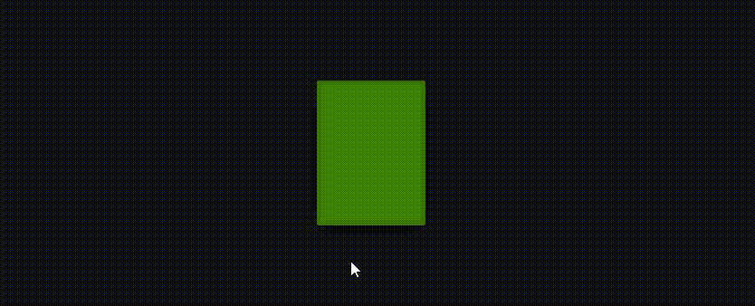
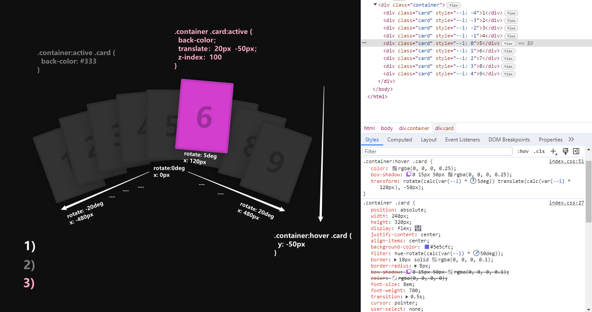

# 一切尽在CSS制作卡牌悬停动画效果之中

本文将介绍一个使用`HTML`和`CSS`实现的**扑克牌悬停**效果动画，这个示例效果演示了如何通过仅使用CSS的**过渡属性**和**旋转函数**来创建有趣生动的扑克牌悬停效果。通过应用**色相旋转**每张卡片都呈现出不同的颜色，当鼠标悬停在卡片上时，会产生旋转和位移展开动画效果并显示内容数字，以及鼠标点击时的背景颜色变化和位移效果🎴。[showtime](https://code.juejin.cn/pen/7297145423533604902)！

<p align=center>

</p>

## HTML 结构
`HTML`部分，主要就是一个类名`.container`的容器，其中包含了`9`个类名`.card`元素，分别显示`1~9`的数字作为内容。
* `card`元素其中通过style属性分别设置了自定义属性`--i(-4~4)`的值，是用来控制每张卡片的特定样式的，详见后面CSS部分。
```html
<!DOCTYPE html>
<html lang="en">

<head>
  <meta charset="UTF-8">
  <meta name="viewport" content="width=device-width, initial-scale=1.0">
  <title>Playing Card Hover Effects</title>

  <link rel="stylesheet" href="./css/index.css">
</head>

<body>
  <div class="container">
    <div class="card" style="--i: -4">1</div>
    <div class="card" style="--i: -3">2</div>
    <div class="card" style="--i: -2">3</div>
    <div class="card" style="--i: -1">4</div>
    <div class="card" style="--i: 0">5</div>
    <div class="card" style="--i: 1">6</div>
    <div class="card" style="--i: 2">7</div>
    <div class="card" style="--i: 3">8</div>
    <div class="card" style="--i: 4">9</div>
  </div>
</body>

</html>
```

## CSS 样式
在`CSS`部分，全局样式进行了一些通用设置和布局等样式的调整，并隐藏水平方向上的溢出内容，防止出现水平滚动条。
```css
/* @import url('https://fonts.googleapis.com/css?family=Poppins:200,300,400,500,600,700,800,900&display=swap'); */
@import './google-fonts.css';

* {
  margin: 0;
  padding: 0;
  box-sizing: border-box;
  font-family: 'Poppins', sans-serif;
}

body {
  min-height: 100vh;
  background-color: #0f0f0f;
  color: #ccc;
  
  display: flex;
  justify-content: center;
  align-items: center;
  overflow-x: hidden;
}
```
然后就是内容`.container`和`card`元素的样式：
* `.container` 元素设置内容水平垂直居中，并让所有子元素相对定位形成堆叠状。
* `.card` 作为卡片元素有固定宽高外，还有具体的一些其它交互样式：
  * 设置默认的背景色`#5e5cfc`以及边框样式，然后通过`hue-rotate()`旋转滤镜根据自定义变量`--i * 50deg`的值，依次是`(-200deg~200deg)`区间，调整每张卡片都具有不同的背景颜色。
  * 当鼠标悬停在父容器`.container`上时，调整文本颜色显现出来和加深阴影效果，通过旋转`--i * 5deg = (-20deg~20deg)`和平移 `--i * 120px = (-480px~480px)`实现弧形展开视觉动画效果。
* `.container:active` 当容器元素被点击时，卡片元素的背景颜色变为`#333`（深灰色）。
* `.container .card:active` 当卡片元素被点击时，它的背景颜色为默认背景色，而此时其它卡片元素是深灰色。并且基于CSS变量计算`x`平移，同时设置`z-index`属性使显示在最上层。
```css
/* ... */

.container {
  position: relative;

  width: 100%;
  display: flex;
  justify-content: center;
  align-items: center;
}

.container .card {
  /* position: absolute; */

  width: 240px;
  height: 320px;
  display: flex;
  justify-content: center;
  align-items: center;
  background-color: #5e5cfc;
  /* -200deg -150deg ... 0deg 50deg 100deg ... */
  filter: hue-rotate(calc(var(--i) * 50deg));
  border: 10px solid rgba(0, 0, 0, 0.1);
  border-radius: 8px;
  box-shadow: 0 15px 50px rgba(0, 0, 0, 0.1);

  /* color: rgba(0, 0, 0, 0); */
  font-size: 8em;
  font-weight: 700;

  transition: 0.5s;
  cursor: pointer;
  user-select: none;
}

.container:hover .card {
  color: rgba(0, 0, 0, 0.25);
  box-shadow: 0 15px 50px rgba(0, 0, 0, 0.25);

  /* rotate: -20deg -15deg ... 0deg 5deg 10deg ... translate: -480px -360px ... 0 120px 240px ...*/ 
  transform: rotate(calc(var(--i) * 5deg)) translate(calc(var(--i) * 120px), -50px);
}

.container:active .card {
  background-color: #333;
}

.container .card:active {
  background-color: #5e5cfc;
  translate: calc(var(--i) * 20px) -50px;
  z-index: 100;
}

```
### 表现


## 相关效果
### 色相旋转：
* [点亮网页的星星粒子动画效果](https://juejin.cn/post/7291564831710543926)
* [「流光边框」CSS巧妙实现元素的流动边框动画](https://juejin.cn/post/7289072902888177701)
* [Input输入框上的占位文本动画效果〰️](https://juejin.cn/post/7278238985453731874)

### 卡片旋转：
* [「堆叠照片」张张都是焦点的轮播图片效果](https://juejin.cn/post/7291125585668341760)
* [CSS轻松实现玻璃拟态质感的卡片与:has()选择器](https://juejin.cn/post/7290017749714092072)

## 最后
通过本篇文章的详细介绍，相信能够帮助你更好地使用`CSS`来创建一个**扑克牌悬停**动画，从而理解掌握和应用这个效果。通过巧妙设置容器和卡片元素的样式，结合**过渡属性**等，实现了当鼠标悬停以及点击时的旋转和位移动画效果，背景颜色变化和位移效果。从而会触发不同的视觉上的反馈🃏。`Lady Luck is smiling`

希望这篇文章对你在开发类似交互动画效果时有所帮助！如果你对这个案列还有任何问题，欢迎在评论区留言或联系(私信)我。码字不易🥲，不要忘了三连鼓励🤟，谢谢阅读，Happy Coding🎉！

源码我放在了[GitHub](https://github.com/vnyoon/web-magic)，里面还有一些酷炫的效果、动画案列，喜欢的话不要忘了 `starred` 不迷路！
