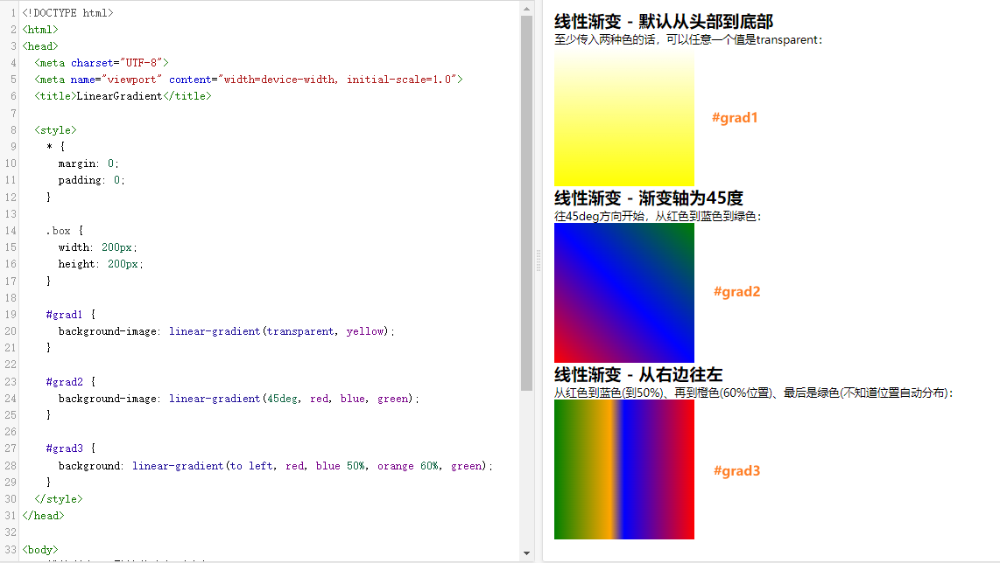

# CSS一步步制作全屏滚动进度条指示器

下面本文将详细介绍怎么仅使用`CSS`制作**网页滚动进度条指示器**的实现方法。在本案例网页中你将看到导航区是一个**包含不同颜色节区的进度条指示器**。接着，当用户滚动页面也就是浏览内容区域时，导航进度条会**根据滚动位置显示相应的颜色**，以显示用户此时在页面中的位置区域。总的来说这个网页将展示一个进度条指示器以及一些它的反馈与交互式功能，对不同内容区域部分的迅速访问导航🛬。[showtime](https://code.juejin.cn/pen/7301226965518778419)！

<p align=center>

</p>

**<p align=center>滚动进度条指示器目前仅适用于Chrome、Edge、Opera浏览器！😶</p>**

## 相关属性
简单介绍本案例中主要使用到的`CSS`属性，具体介绍和详细用法可以点击到`MDN`查看：

### [animation-timeline](https://developer.mozilla.org/en-US/docs/Web/CSS/animation-timeline#browser_compatibility)
指定用于控制CSS动画进度的时间轴。表示动画的时间轴。

`scroll()`CSS函数在这里一起使用，是指当传入一个可滚动的元素后，滚动条将为当前元素(本案例是`nav::before`)提供滚动进度时间线。

#### 兼容性
截止目前(23/11/16)，该API仅在`Chrome`、`Edge`、`Opera`浏览器中有效，当然是最新的版本。如下图所示：


### [linear-gradient()](https://developer.mozilla.org/zh-CN/docs/Web/CSS/gradient/linear-gradient)
创建一个表示两种或多种颜色线性渐变的图像。函数需要至少传入两种颜色，当然还可以实现不同方向(角度)的渐变效果。如果不指定方向，默认从上到下渐变。



#### 参考文章
* [CSS选择器创建从平凡到立体的3D独特视觉效果](https://juejin.cn/post/7293789904482615335)
* [CSS轻松实现玻璃拟态质感的卡片与:has()选择器](https://juejin.cn/post/7290017749714092072)
* [「中秋元素相册」3D视觉画廊展示旋转播放走马灯](https://juejin.cn/post/7279720035735830580)

## 构建 HTML
首先，在`HTML`中，整体而言构建了一个简单的网页结构，包含导航(`.nav`)、内容区域(`.container`)的各个章节(`.section`)和一些提示信息(`.wraning`、`.hint`)。
* 导航部分里的锚点链接添加`href`属性是某个元素的`id`值时，当点击这个链接后会根据元素设置的`id`，页面滚动到指定元素的位置，注意不要写错。
* 每个章节使用了自定义的样式变量`--bg-colr`来指定不同的背景颜色。
* 网页底部与右侧会固定展示一个警告信息和一些图标提示信息。
```html
<!DOCTYPE html>
<html lang="en">

<head>
  <meta charset="UTF-8">
  <meta name="viewport" content="width=device-width, initial-scale=1.0">
  <title>Scroll Progress Bar</title>

  <link rel="stylesheet" href="//at.alicdn.com/t/c/font_4329990_f694ra4vq6.css">
  <link rel="stylesheet" href="./css/index.css">
</head>

<body>
  <nav>
    <a href="#html">HTML</a>
    <a href="#css">CSS</a>
    <a href="#js">JavaScript</a>
    <a href="#vue">Vue</a>
    <a href="#react">React</a>
  </nav>

  <div class="container">
    <div class="section" id="html" style="--bg-colr: #4b7eff">
      <h2>HTML</h2>
      <p>Hyper Text Markup Language</p>
    </div>
  
    <div class="section" id="css" style="--bg-colr: #ff6464">
      <h2>CSS</h2>
      <p>Cascading Style Sheets</p>
    </div>
  
    <div class="section" id="js" style="--bg-colr: #ffd966">
      <h2>JavaScript</h2>
      <p>Client-Side Scripting Language</p>
    </div>
  
    <div class="section" id="vue" style="--bg-colr: #42b883">
      <h2>Vue</h2>
      <p>Building UI On The Web</p>
    </div>
  
    <div class="section" id="react" style="--bg-colr: #8e67cd">
      <h2>React</h2>
      <p>Building Web And Native Interface</p>
    </div>
  </div>

  <div class="warning">Progerss Bar Only Works On Chrome, Edge, Opera, etc</div>

  <div class="hint">
    <i class="iconfont icon-v-up"></i>
    <i class="iconfont icon-vertical-rounded"></i>
    <i class="iconfont icon-mouse"></i>
    <i class="iconfont icon-vertical-rounded"></i>
    <i class="iconfont icon-v-down"></i>
  </div>
</body>

</html>
```

## 添加 CSS
接下来，看`CSS`部分对于默认样式的重置。定义了一些颜色CSS变量方便更改。并且当文档滚动时，滚动行为设置为`smooth`平稳的滚动，使锚点跳转时的滚动也更流畅。
```css
/* @import url('https://fonts.googleapis.com/css2?family=Ubuntu:wght@300;400;500;700&display=swap'); */
@import './google-fonts.css';

* {
  margin: 0;
  padding: 0;
  box-sizing: border-box;
}

html {
  --primary-colr: #fff;

  --h-colr: #4b7eff;
  --c-colr: #ff6464;
  --j-colr: #ffd966;
  --v-colr: #42b883;
  --r-colr: #8e67cd;

  scroll-behavior: smooth;
}

a {
  text-decoration: none;
  color: var(--primary-colr);
}

body {
  font-family: 'Ubuntu', sans-serif;
}

/* ... */
```
下面就来一步步处理其它主要元素的样式。使用了伪元素来创建进度条，通过设置的伪元素的宽度和背景色，以及使用动画来控制进度条的变化，实现了滚动进度条的效果：
1. 首先，对于导航部分`.nav`元素定位固定在顶部。
  * 每个`a`元素都设置左右下边框，更能明确当前浏览到哪个区域。并且通过伪类选择器选中第`2~5`个a元素，当鼠标悬浮时设置背景色(第1个会使用渐变背景设置)。
  * 使用`::before`伪元素创建水平方向的渐变背景。其中`90deg`就是`to right`。根据不同的变量定义，分为不同的色段，直到最终宽度达到`100vw`。
  ```css
  /*... */
  nav {
    position: fixed;

    width: 100vw;
    height: 50px;
    line-height: 50px;
    background-color: #343434;

    display: flex;
    align-items: center;
  }

  nav a {
    flex: 1;

    font-size: 1.4rem;
    text-align: center;
    border: 2px solid #000;
    border-top-width: 0;
    border-bottom-width: 4px;
    transition: background-color 0.5s;
  }
  nav a:first-child {
    border-left-width: 0;
  }

  nav::before {
    content: "";
    position: absolute;
    z-index: -1;

    width: 20vw;
    height: 100%;
    background: linear-gradient(
      90deg, 
      var(--h-colr) 0 20vw, 
      var(--c-colr) 0 40vw, 
      var(--j-colr) 0 60vw, 
      var(--v-colr) 0 80vw, 
      var(--r-colr) 0 100vw
    );
  }

  nav a:nth-child(2):hover {
    background-color: var(--c-colr);
  }
  nav a:nth-child(3):hover {
    background-color: var(--j-colr);
  }
  nav a:nth-child(4):hover {
    background-color: var(--v-colr);
  }
  nav a:nth-child(5):hover {
    background-color: var(--r-colr);
  }
  ```
  

2. 其次，对于内容部分`.section`根据自定义变量设置不同背景色和一定高度`100vh`。
3. 接着，为了让动画体现出来，给`::before`添加关键帧动画以及滚动进度时间线后，实现滚动渐变背景效果。
4. 然后，就是把一些告知浏览者的**额外说明和指导**(`.warning`、`.hint`)元素的样式写一下，定位在不遮挡实际内容又能注意到的地方就行了。
```css
nav::before {
  /* ... */
  animation: scrollProgress linear;
  animation-timeline: scroll(root);
}
@keyframes scrollProgress {
  100% {
    width: 100vw;
  }
}

div.section {
  height: 100vh;
  display: flex;
  flex-direction: column;
  justify-content: center;
  align-items: center;

  background-color: var(--bg-colr);
  border-bottom: 3px solid #000;
  color: var(--primary-colr);
  font-size: 3.5rem;  
}
.section p {
  font-size: 1.25rem;
}

.warning {
  position: fixed;
  bottom: 0;

  width: 100%;
  text-align: center;
  color: var(--primary-colr);
  font-size: 1.25rem;
  padding: 20px 0;
}
.warning::before {
  content: "*";
  position: absolute;
  color: #f00;
  transform: translateX(-10px);
}

.hint {
  position: fixed;
  top: 50%;
  right: 20px;
  transform: translateY(-50%);

  display: flex;
  flex-direction: column;
}
.hint i {
  font-size: 3rem;
  color: var(--primary-colr);
}
.hint::after {
  content: "Scroll";
  position: absolute;
  right: 3rem;
  top: 50%;
  transform: translateY(-50%);
  font-size: 1.5rem;
  color: var(--primary-colr);
}


@media screen and (max-width: 768px) {
  html {
    font-size: 12px;
  }

  .hint::after {
    content: "";
  }
}

@media screen and (max-width: 576px) {
  html {
    font-size: 10px;
  }
}

```

## 最后
本文的实现方法简洁明了，通过`HTML`和`CSS`的结合，实现了一个简单而实用的**滚动进度条指示器**效果，并让网页具有滚动进度条和交互导航功能。同时，使用了`@media`查询来使页面在不同屏幕尺寸下有不同的字体大小，提高页面的可读性和适配性。

你也可以根据自己的需求进行调整，进一步改善和扩展这个效果。希望这篇文章对你在开发类似交互动画效果时有所帮助！如果你对这个案列还有任何问题，欢迎在评论区留言或联系(私信)我。码字不易🥲，不要忘了三连鼓励🤟，谢谢阅读，Happy Coding🎉！

源码我放在了[GitHub](https://github.com/vnyoon/web-magic)，里面还有一些酷炫的效果、动画案列，喜欢的话不要忘了 `starred` 不迷路！
