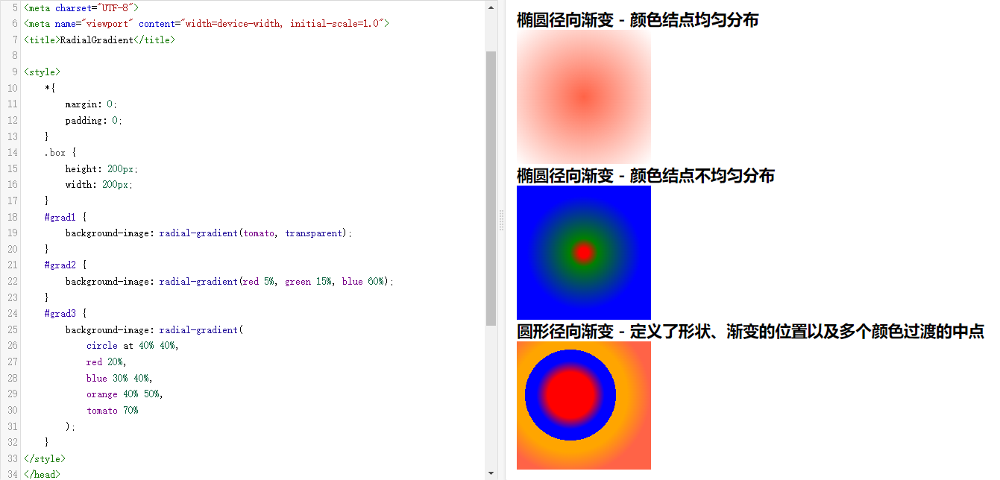

# 创意卡片交互：掌握发光边角框悬停效果✨

## 前面
本篇文章中主要详细介绍 **发光边角悬停效果** 的实现，接下来将使用 `HTML` 结构、`CSS` 样式和 `JavaScript` 事件处理来实现。通过逐步分析代码，特别注意 `JS` 部分，以便能够完全理解实现这一交互动态效果的过程。这个效果所展现的是当用户鼠标在卡片元素上移动时，会出现一个 **径向渐变的色彩光圈**，仔细看会发现 **卡片边框** 位置颜色会亮一点，继续把 **光圈中心(光标)** 移至边框上时会显得更亮，最后接着鼠标移出卡片时光圈消失。这样的效果会给界面元素带来动态和吸引力，它使色彩光圈在鼠标移动时像 **磁铁** 一样跟随鼠标移动⬛。[showtime]()！

### 结论
先说主要实现思路就是，当鼠标在卡片`.card`上移动时，通过`JS`计算出鼠标当前在元素中的位置(`x`、`y`)，然后赋值给`before`伪元素并且该元素实现一个色彩图像，接着`after`伪元素创建一个蒙层并整体小于卡片元素`2px`，通过鼠标悬浮伪类移入卡片时显示`before`元素，因为保留了卡片2px没有被after元素覆盖，这样就显的边框(`.card`)位置比较亮。

<p align=center>

</p>

**<p align=center>移动端建议在PC端查看效果~😶</p>**

### 涉及属性
简单介绍本案例中主要使用到的一些属性，具体介绍和详细用法可以点击到`MDN`查看：
* MouseEvent
  - [pageX/pageY](https://developer.mozilla.org/zh-CN/docs/Web/API/MouseEvent/pageX)：相对于整个文档(`document`)以像素为单位的 `x`(水平)，`y`(垂直)坐标值。
* HTMLElement
  - [offsetParent](https://developer.mozilla.org/zh-CN/docs/Web/API/HTMLElement/offsetParent)：表示最近的祖先元素。如果最近的祖先元素被定位(不为`static`)那么就是。
  - [offsetLeft](https://developer.mozilla.org/zh-CN/docs/Web/API/HTMLElement/offsetLeft)：返回当前元素左上角相对于 `offsetParent` 元素左边界的像素值。
  - [offsetTop]()：当前元素相对于 `offsetParent` 元素顶部内边距的距离。
* [radial-gradient()](https://developer.mozilla.org/zh-CN/docs/Web/CSS/gradient/radial-gradient)
默认用径向渐变创建出椭圆色彩"图像"。创建径向渐变最少需要传入两个颜色值。可以更改形状、大小、渐变的位置以及颜色起止位置。


## HTML 结构
在 `HTML` 中，有一个容器(`.container`)包含了多个卡片，每个卡片(`.card`)都有一个独特的颜色。
* 鼠标移动时出现的光圈颜色通过在内联样式中定义为变量。这样做的好处就是不用再添加不同类名，进而用伪类选择器设置不同颜色了。
```html
<!DOCTYPE html>
<html lang="en">

<head>
  <meta charset="UTF-8">
  <meta name="viewport" content="width=device-width, initial-scale=1.0">
  <title>Glowing Corner Hover Effects</title>

  <link rel="stylesheet" href="./index.css">
</head>

<body>
  <div class="container">
    <div class="card" style="--clr: #f00;"></div>
    <div class="card" style="--clr: #0f0;"></div>
    <div class="card" style="--clr: #0fe;"></div>
    <div class="card" style="--clr: #ff0;"></div>
  </div>
</body>

</html>
```

## CSS 样式
接下来，看 `CSS` 部分的代码，一些基本的样式重置与水平垂直居中布局排版。
* 每个卡片设置了固定的大小与深色背景色，此时基本布局结构已然成型。
```css
* {
  margin: 0;
  padding: 0;
  box-sizing: border-box;
}

body {
  min-height: 100vh;
  background-color: #222;

  display: flex;
  justify-content: center;
  align-items: center;
}

.container {
  display: flex;
  flex-wrap: wrap;
  justify-content: center;
  align-items: center;
  gap: 50px;
}

.container .card {
  width: 300px;
  height: 300px;
  background-color: rgba(45, 45, 45, 1);
  border-radius: 20px;
  overflow: hidden;

  position: relative;
}
```

## JavaScript 交互
接着，来到`JavaScript`部分，用来计算光圈在卡片里的位置。
* 当鼠标光标在卡片元素内移动时，获取鼠标在整个**文档的坐标**(X、Y)，并减去**按钮相对于边界的偏移量**(offset Left/Top)，确定鼠标相对于按钮的位置。通过 `setProperty` 动态设置**自定义变量**(x、y)的值。
```js
  const cards = document.querySelectorAll('.card');

  cards.forEach(card => {
    card.onmousemove = (event) => {
      const { pageX, pageY } = event;
      
      const x = pageX - card.offsetLeft,
            y = pageY - card.offsetTop;
      
      card.style.setProperty('--x', x + 'px');
      card.style.setProperty('--y', y + 'px');
    }
  })
```

## 添加 CSS
* 使用`.card::before`伪元素创建彩色光圈。
  - 渐变背景色由前面内联样式中定义的变量 `--clr` 决定。
  - 相对于父元素定位，位置取决于自定义变量 `x、y`。
  - 大小要设置大一点，最起码要大于卡片大小，这样移入时才能照到边框位置(朦胧亮)。或者可以调整渐变背景，少一个透明色，光圈颜色越深边框就会更亮。
* 使用`.card::after`伪元素创建一个覆盖蒙层。
  - 这个元素小于卡片元素`2px`的作用就是突出边框的颜色，达到发光边角的样子。
```css
.container .card::before {
  content: "";
  position: absolute;
  left: var(--x);
  top: var(--y);
  transform: translate(-50%, -50%);

  width: 600px;
  height: 600px;
  background: radial-gradient(var(--clr), transparent, transparent);
  opacity: 0;
  transition: opacity 0.5s;
}

.container .card:hover::before {
  opacity: 1;
}

.container .card::after {
  content: "";
  position: absolute;
  inset: 2px;
  border-radius: 18px;
  background-color: rgba(45, 45, 45, 0.75);
}

```

### 表现


### 参考文章
* [创意按钮交互：方向感知磁性悬停效果🧲](https://juejin.cn/post/7275550906220347446)

## 最后
这种效果的核心在于 `JavaScript` 代码。使色彩光圈在用户的光标移动到卡片区域内时跟随光标，从而创建出**磁性效果**。总而言之，如果想要在某些界面上添加动态的卡片效果，也许**发光边角悬停效果**也是一种选择之一，可以增强用户在你的界面上的交互体验。

或者甚至你也可以根据自己的需求进行调整，进一步改善和扩展这个效果。希望这篇文章对你在开发类似交互动画效果时有所帮助！如果你对这个案列还有任何问题，欢迎在评论区留言或联系(私信)我。码字不易🥲，不要忘了三连鼓励🤟，谢谢阅读，Happy Coding🎉！

源码我放在了[GitHub](https://github.com/vnyoon/web-magic)，里面还有一些酷炫的效果、动画案列，喜欢的话不要忘了 `starred` 不迷路！
