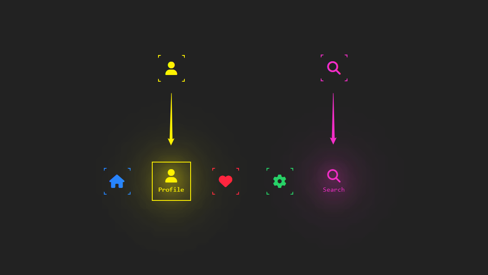
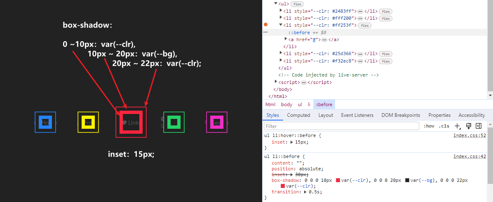
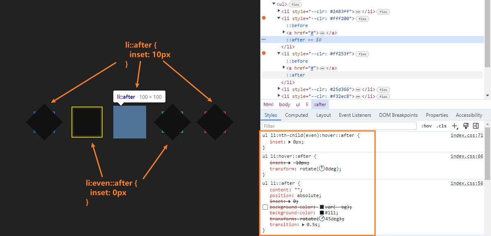
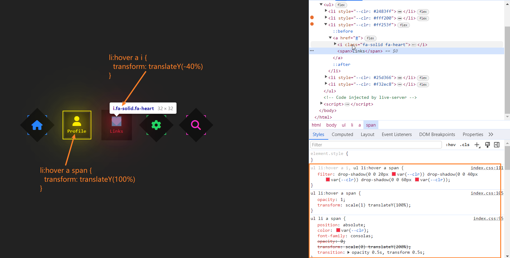

# 「全是技巧」赋予图标动感十足的悬停交互效果 

## 前面
本文将详细介绍如何使用 `HTML` 和 `CSS` 制作**创意图标悬停效果**。这个效果主要表现为，最初是一排具有 **不同颜色** 与 **四角括号** 的图标展示，当鼠标悬浮在任一图标上时，四角括号消失或出现边框，图标上移底部出现相应文字信息，并且二者具有模糊阴影。当然一整个过程是有设置过渡效果的。独特的图标 `🏠🤴❤️⚙️🔍` 交互体验为应用添加更丰富的交互性和吸引力。[showtime]()

<p align=center>

</p>

## 构建 HTML
在`HTML`结构中，通过`<ul>`和`<li>`标签创建了一个无序列表。每个列表项定义了自定义变量`--clr`用来设置图标和文字的颜色。

并且每个li都包含一个`<a>`锚链接。而在每个锚链接中，使用了`<i>`标签来显示`Font Awesome`图标，同时还包含了一个`<span>`标签用于显示相应的图标名称。
```html
<!DOCTYPE html>
<html lang="en">

<head>
  <meta charset="UTF-8">
  <meta name="viewport" content="width=device-width, initial-scale=1.0">
  <title>CSS Creative Icon Hover Effects</title>

  <link rel="stylesheet" href="https://cdnjs.cloudflare.com/ajax/libs/font-awesome/6.4.2/css/all.min.css" />
  <link rel="stylesheet" href="./index.css">
</head>

<body>
  <ul>
    <li style="--clr: #2483ff">
      <a href="#">
        <i class="fa-solid fa-house"></i>
        <span>Home</span>
      </a>
    </li>

    <li style="--clr: #fff200">
      <a href="#">
        <i class="fa-solid fa-user"></i>
        <span>Profile</span>
      </a>
    </li>

    <li style="--clr: #ff253f">
      <a href="#">
        <i class="fa-solid fa-heart"></i>
        <span>Links</span>
      </a>
    </li>

    <li style="--clr: #25d366">
      <a href="#">
        <i class="fa-solid fa-gear"></i>
        <span>Settings</span>
      </a>
    </li>

    <li style="--clr: #f32ec8">
      <a href="#">
        <i class="fa-solid fa-magnifying-glass"></i>
        <span>Search</span>
      </a>
    </li>
  </ul>
</body>

</html>
```

## 添加 CSS 
在`CSS`样式中，设置了一些基本的全局样式，重置默认样式、内容水平垂直居中布局、背景字体颜色等不做过多赘述。
```css
* {
  margin: 0;
  padding: 0;
  box-sizing: border-box;
}

:root {
  --bg: #222;
}

li { list-style: none; }

a { text-decoration: none; color: #555; }

body {
  min-height: 100vh;
  background-color: var(--bg);

  display: flex;
  justify-content: center;
  align-items: center;
}

/* ... */
```

### 实现
先说实现思路，其实很简单。没有特性，全是技巧😛：
1. 使用`li::before`伪元素创建相对于li定位四个方向设置一定距离的矩形，通过添加多个阴影扩散效果，形成了一个阴影矩形。鼠标悬停li时阴影矩形变大。


2. 使用`li::after`伪元素创建相对于li定位并且大小一致，背景色与网页一致，注意这里旋转了`45deg`，这样就把::before四角漏出来了表现出了四角括号。鼠标悬停li时。扩大::after的大小不再旋转，此时会盖住::before的阴影，不过又通过伪类选择偶数兄弟元素重置了大小，所以会展示边框。


```css

ul {
  padding-inline: 50px;
  display: flex;
  flex-wrap: wrap;
  gap: 50px;
}
ul li {
  position: relative;

  width: 80px;
  height: 80px;
  display: flex;
  justify-content: center;
  align-items: center;
  
  cursor: pointer;
}

ul li::before {
  content: "";
  position: absolute;
  inset: 30px;
  /* 模糊半径：10，20，22 */
  box-shadow: 0 0 0 10px var(--clr), 
              0 0 0 20px var(--bg), 
              0 0 0 22px var(--clr);
  transition: 0.5s;
}
ul li:hover::before { 
  inset: 15px;
}

ul li::after {
  content: "";
  position: absolute;
  inset: 0;
  background-color: var(--bg);
  /*错位展示::before四角阴影  */
  transform: rotate(45deg);
  transition: 0.5s;
}
ul li:hover::after {
  /*复原盖住::before阴影  */
  transform: rotate(0deg);
  inset: -10px;
}
ul li:nth-child(even):hover::after {
  /*偶数展示::before阴影  */
  inset: 0px;
}

/* ... */
```

3. 接着，通过一些样式，可以实现图标在悬停时的缩放、阴影、旋转等动画效果，同时也为图标的名称添加了透明度和位移变换，使得文字在悬停时以动画形式显示出来。锚点元素设置层级确保在伪元素的上方：
* `i`元素当悬浮是垂直上方平移，也就是`-40%`，和文字有一定距离。
* `span`元素开启定位后，垂直下方平移`200%`，透明度不可见，缩放元素为`0`。当悬浮时，透明度可见，缩放元素为原来大小以及上移`100%`的位置。

然后就是悬浮时，通过`filter`属性沿二者的轮廓生成阴影效果。


```css
ul li a {
  position: relative;
  z-index: 1;

  display: flex;
  justify-content: center;
  align-items: center;
}

ul li a i {
  font-size: 2em;
  color: var(--clr);

  transition: transform 0.5s;
}
ul li:hover a i {
  transform: translateY(-40%);
}

ul li a span {
  position: absolute;

  color: var(--clr);
  font-family: consolas;

  opacity: 0;
  transform: scale(0) translateY(200%);
  transition: opacity 0.5s, transform 0.5s;
}
ul li:hover a span { 
  opacity: 1;
  transform: scale(1) translateY(100%);
}

ul li:hover a i,
ul li:hover a span {
  filter: drop-shadow(0 0 20px var(--clr)) 
          drop-shadow(0 0 40px var(--clr)) 
          drop-shadow(0 0 60px var(--clr));
}

```


## 最后
通过本篇文章的详细介绍，相信能够帮助你更好地使用`CSS`来制作一个**图标和文本**的动画，从而理解掌握和应用这个效果。图标及名称以动画形式显示出来，加深了用户对图标的识别和理解。或者甚至你也可以根据自己的需求进行调整，进一步改善和扩展这个效果。

希望这篇文章对你在开发类似交互动画效果时有所帮助！如果你对这个案列还有任何问题，欢迎在评论区留言或联系(私信)我。码字不易🥲，不要忘了三连鼓励🤟，谢谢阅读，Happy Coding🎉！

源码我放在了[GitHub](https://github.com/vnyoon/web-magic)，里面还有一些酷炫的效果、动画案列，喜欢的话不要忘了 `starred` 不迷路！
