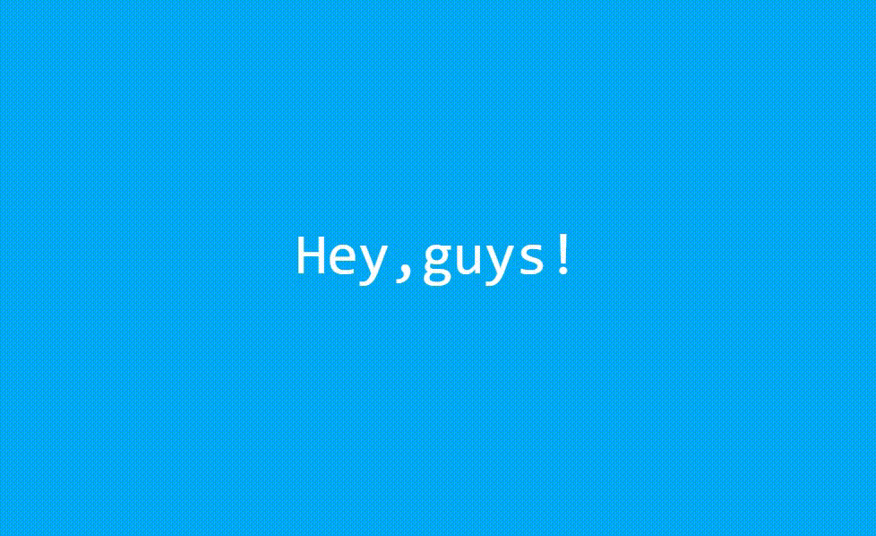
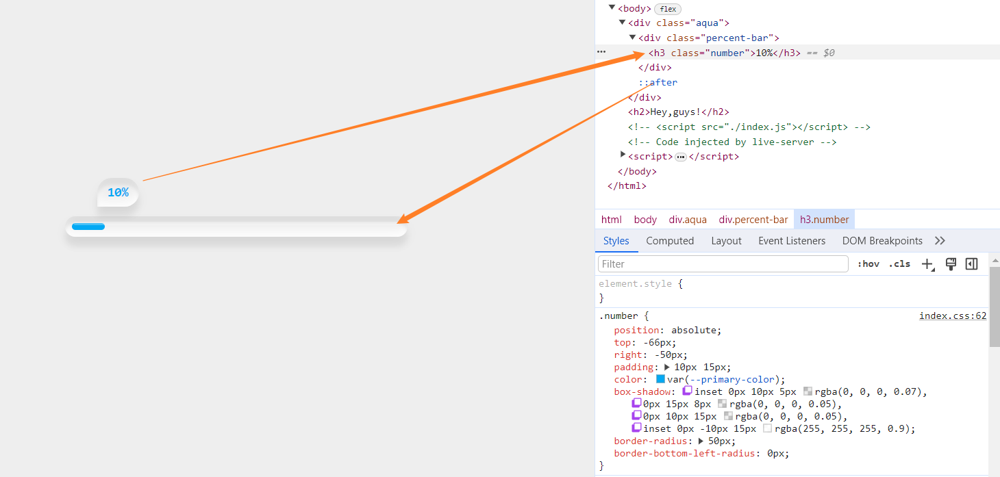

# 「视觉反馈」简单生动的屏幕预加载动画效果

## 前面
屏幕预加载效果是一种常见的交互，可以让浏览者在加载过程中获得较好一点的视觉反馈。在本篇文章中主要详细介绍网页 **屏幕预加载器** 的实现，接下来将使 `HTML`、`CSS` 和 `JavaScript` 来实现。通过鸭步步分析`code`，特别关注 `JS` 部分，以便能够完全理解实现这动画效果的过程🐌。

这个动画初始时显示为`0%`，然后随着时间推进，通过`JavaScript`中的代码计算逐渐增加，直到达到`100%`。在增加百分比的过程中，页面上的百分比数字和进度条的宽度会逐渐增加，直到加载完成。加载完成后呢，进度条会消失，页面背景随之发生颜色变化，并显示出招呼语。[showtime](https://code.juejin.cn/pen/7307593290004561957)

<p align=center>

</p>

## HTML 结构
首先，看 `HTML` 构建了一个简单的布局：
* 一个加载器主要由三部分组成分别是水柱`.aqua`、进度条`percent-bar`和进度时`.number`。
* 一个问候标题。
```html
<!DOCTYPE html>
<html lang="en">

<head>
  <meta charset="UTF-8">
  <meta name="viewport" content="width=device-width, initial-scale=1.0">
  <title>Screen Preloader</title>

  <link rel="stylesheet" href="./index.css">
</head>

<body>
  <div class="aqua">
    <div class="percent-bar">
      <h3 class="number">0%</h3>
    </div>
  </div>

  <h2>Hey,guys!</h2>

  <script src="./index.js"></script>
</body>

</html>
```
同时也引入了 `JavaScript` 文件用来处理进度条的动态变化。

## CSS 样式
接着，看 `CSS` 代码部分，定义了页面的整体样式，包括背景色、字体、布局和背景色的过渡效果。
```css
* {
  margin: 0;
  padding: 0;
  box-sizing: border-box;
}

:root {
  --primary-color: #03a9f4;
}

body {
  min-height: 100vh;
  background-color: #eee;
  
  display: flex;
  justify-content: center;
  align-items: center;

  font-family: consolas;

  transition: background-color 0.5s;
  transition-delay: 0.2s;
}

/* ... */
```
然后就是加载器的样式包括进度条的颜色和形状，以及进度文字的样式：`aqua`、`percent-bar` 和 `number` 元素的 CSS 代码。
### 水柱体元素
为元素添加多个阴影效果，包括内阴影和外阴影增加元素的立体感。也定义了过渡效果使元素的显现和隐藏具有平滑的过渡。通过`::after`伪元素创建了一个白色条纹为进度条增添层次感。
```css
.aqua {
  position: relative;
  
  width: 70vw;
  max-width: 500px;
  padding: 10px;
  border-radius: 50px;
  box-shadow: inset 0px 10px 5px rgba(0, 0, 0, 0.07), 
              0px 15px 8px rgba(0, 0, 0, 0.05),
              0px 10px 15px rgba(0, 0, 0, 0.05),
              inset 0px -10px 15px rgba(255, 255, 255, 0.9);
  
  transition: opacity 0.5s, visibility 0.5s;
}

.aqua::after {
  content: "";
  position: absolute;
  top: 8px;
  left: 50%;
  transform: translateX(-50%); 
  width: 95%;
  height: 5px;
  background-color: #fff4;
  border-radius: 20px;
}

/* ... */
```

### 进度条元素
可以先预设`10%`的宽度，方便调整样式，并且设置固定的高度。使用主色调变量便于更改。呈现出圆形外观：
```css

.percent-bar {
  position: relative;
  
  /* width: 10%; */
  width: 0;
  height: 10px;
  background-color: var(--primary-color);
  border-radius: 20px;
}
```
### 进度时元素 💭
相对于进度条进行定位，位置通过改变进度条预设的宽度，可以慢慢调整位置，做些细微的改变。也具有和水柱体一样的阴影。改变圆角呈现椭圆形外观气泡，更能代表指向进度条。
```css

.number {
  position: absolute;
  top: -66px;
  right: -55px;
  padding: 10px 15px;
  color: var(--primary-color);
  box-shadow: inset 0px 10px 5px rgba(0, 0, 0, 0.07),
              0px 15px 8px rgba(0, 0, 0, 0.05),
              0px 10px 15px rgba(0, 0, 0, 0.05),
              inset 0px -10px 15px rgba(255, 255, 255, 0.9);
  border-radius: 50px;
  border-bottom-left-radius: 0px;
}
```

这些 `CSS` 样式定义了元素的外观和布局，为它们赋予了生动的视觉效果，从而为整体网页提供了动态和吸引力的外观。

## JavaScript 交互
在`JavaScript`中提供了反馈行为，首先获取需要操作的`DOM`，然后使用`setInterval`函数不断递增一个变量，更新进度条的宽度和数字显示，模拟加载进度。一旦加载完成(`100%`)，就会隐藏加载器、并改变网页背景色显示文字。
```js
/**进度 */
let i = 0;

const body = document.querySelector('body'),
      aquaEle = document.querySelector('.aqua'),
      percentBarEle = document.querySelector('.percent-bar'),
      numberEle = document.querySelector('.number'),
      welcEle = document.querySelector('h2');
      
let interval = setInterval(() => {
  const text = `${i}%`;

  numberEle.textContent = text;
  percentBarEle.style.width = text;

  i+=2;

  if (i > 100) {
    clearInterval(interval);

    /**隐藏加载 */
    aquaEle.style.opacity = '0';
    aquaEle.style.visibility = 'hidden';

    /**改变背色 */
    body.style.backgroundColor = `var(--primary-color)`;
    
    /**显示文字 */
    welcEle.style.opacity = '1';
    welcEle.style.visibility = 'visible';
  }
}, 50);

```

### 表现


## 最后
综上就是一个 **简单而生动的加载器** 。例子展示动态进度条和背景色切换的实现过程。主要通过 `JS` 代码，设置动态进度条的宽度和显示隐藏，以及动态改变背景色。通过本文的介绍，希望可以帮助你更好地理解和应用这些前端技术，从而创建一个简单而优雅的 **屏幕预加载效果** 🐛。

或者你也可以根据自己的需求进行调整，进一步改善和扩展这个效果。如果你对这个案例还有任何问题，欢迎在评论区留言或联系(私信)我。码字不易🥲，不要忘了三连鼓励🤟，谢谢阅读，Happy Coding🎉！

源码我放在了[GitHub](https://github.com/vnyoon/web-magic)，里面还有一些酷炫的效果、动画案列，喜欢的话不要忘了 `starred` 不迷路！
