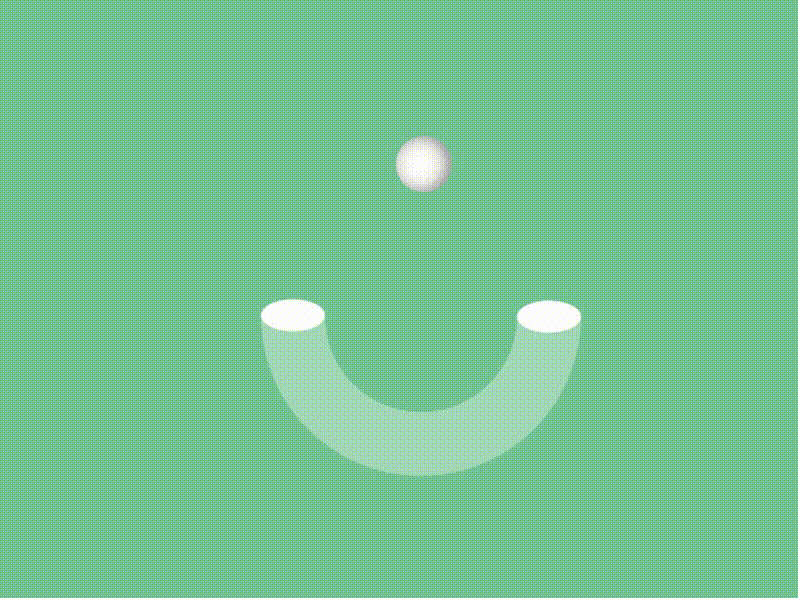

# 「律动之光」图形与炫彩背景的交互动画效果

在本篇文章中，将详细介绍怎样使用`HTML`、`CSS`和`JavaScript`创建一个具有 **随机背景颜色** 和 **动态图形交互** 效果的网页动画。这个效果呈现了图形(u)动画与页面背景色的交互，当圆球跳动到图形元素两端时，页面背景色会随机变化颜色。实际上是圆球与图形元素应用了同频的动画，然后利用不同的旋转效果，才展现出白色圆球碰撞到图形元素两端时会反复弹起跳动⚪。[showtime](https://code.juejin.cn/pen/7308683590680707113)！

<p align=center>

</p>

## HTML 结构
简单的`HTML`代码，创建一个具有类名`.box`图形容器，其中包含了`圆球`元素。然后引入外部`.css`和`.js`文件。
```html
<!DOCTYPE html>
<html lang="en">

<head>
  <meta charset="UTF-8">
  <meta name="viewport" content="width=device-width, initial-scale=1.0">
  <title>Random BG Animation</title>

  <link rel="stylesheet" href="./index.css">
</head>

<body>
  <div class="box">
    <div class="circle"></div>
  </div>

  <script src="./index.js"></script>
</body>

</html>
```

## CSS 样式
老规矩对网页先做了一下初始化样式，然后把实际要输出的内容布局到网页水平垂直居中。

首先，`box` 元素实现了一个u形圆柱体的图形，通过关键帧 `@keyframes` 设置了图形旋转的动画效果。
* 元素具有固定的宽高。定义一个`80px`宽(图形的粗细)的透明实线边框，只设置了右、下边框的的颜色使其显示出来，并设置圆角半径为`50%`，此时元素就呈现`u`形了。
```css
* {
  margin: 0;
  padding: 0;
  box-sizing: border-box;
}

:root {
  --primary-color: #fff;
}

body {
  min-height: 100vh;
  background-color: #222;
  
  display: flex;
  justify-content: center;
  align-items: center;

  overflow: hidden;
}

.box {
  position: relative;

  width: 400px;
  height: 400px;

  border: 80px solid transparent;
  border-right-color: #fff5;
  border-bottom-color: #fff5;
  border-radius: 50%;
  
  transform: rotate(45deg);
}

/* ... */
```

其次，使用两个伪元素实现了图形元素的两端实心椭圆。为了方便调整样式先对`.box`元素进行`45`度的旋转。
* 两个伪元素具有固定的宽高不相同并设置圆角形成椭圆。进行`-45`度旋转抵消父元素的旋转。相对于父元素定位慢慢调整到相应的位置。
```css

.box::before {
  content: "";
  
  width: 80px;
  height: 40px;
  background-color: var(--primary-color);
  border-radius: 50%;
  transform: rotate(-45deg);
  
  position: absolute;
  top: 212px;
  left: -34px;
}

.box::after {
  content: "";
  
  width: 80px;
  height: 40px;
  background-color: var(--primary-color);
  border-radius: 50%;
  transform: rotate(-45deg);
  
  position: absolute;
  bottom: 212px;
  right: -34px;
}

/* ... */
```

接着，`circle`元素实现了一个立体感的圆球。
* 指定了元素基准旋转点为距离左侧 `200px` 的位置就是调整到`::after`元素位置。使得元素在进行旋转动画时以指定的点为中心进行旋转。
* 再根据`transform: rotate(-45deg);`属性可以旋转到`::before`元素位置，得到往右侧需要旋转`135deg`刚好是一个半圆距离(45+135)。
* 然后就是定位距离的调整使其在两个伪元素的两端上旋转跳动。
```css

.circle {
  width: 70px;
  height: 70px;
  background-color: var(--primary-color);
  border-radius: 50%;
  box-shadow: inset 0px 5px 20px rgba(0, 0, 0, 0.5);
  
  transform-origin: 200px;
  animation: animateBall 2s linear infinite;  
  
  position: absolute;
  z-index: 10;
  top: 65px;
  left: -95px;
}
@keyframes animateBall {
  0%, 100% {
    transform: rotate(135deg);
  }

  50% {
    transform: rotate(-45deg);
  }
}

```

最后，创建`.box`图形的关键帧，定义元素在动画周期(`2s`)内的状态。
* `0%, 100%`：动画的起始和结束(`0~2s`)状态，将元素设置为不旋转(0度)，即初始状态(::after元素在上)。
* `50%`：动画的中间(`1s`)状态，将元素旋转90度(::before元素在上)。
```css
.box {
  /* ... */
  animation: animateBox 2s linear infinite;
}
@keyframes animateBox {
  0%, 100% {
    transform: rotate(0deg);
  }

  50% {
    transform: rotate(90deg);
  }  
}

/* ... */
```

### 图示


`CSS`设置了元素的动态旋转效果，结合了**旋转框**和**旋转球**两个动画元素。

## JavaScript 交互
`JavaScript` 代码先定义了一个名为 `changePageBG` 的函数，该函数就是用于改变页面的背景颜色的。随后在 `setInterval` 函数中，每隔 `1s` 调用一次该函数。因为元素的动画周期时2s，当动画执行到50%时，此时过去了1s圆球在图形的一端之上，所以就可以改变页面颜色了达成交互效果。

函数内部时一个名为 `randomFn` 的函数，用于随机生成 `0~255` 之间的数值。每1s生成3个数值，随后使用`rgb`函数设置`body`的样式。
```javascript
function changePageBG() {
  const randomFn = (range = 255) => Math.floor(Math.random() * range);

  const red = randomFn();
  const green = randomFn();
  const blue = randomFn();
  
  document.body.style.backgroundColor = `rgb(${red} ${green} ${blue})`;
};

setInterval(changePageBG, 1000);

```

## 最后
通过本篇文章的详细介绍，相信能够帮助你更好的创建 **一个有趣的网页动画**，从而理解掌握和应用这个效果。当浏览者访问页面时，他们将看到一个 **旋转的图形** 和 **跳动的圆球** 不断碰撞，同时还有 **不断变化的背景颜色** ，为页面增加了动态的视觉效果与活力。

你也可以根据自己的需求进行调整，进一步改善和扩展这个效果。希望这篇文章对你在开发类似交互动画效果时有所帮助！如果你对这个案列还有任何问题，欢迎在评论区留言或联系(私信)我。码字不易🥲，不要忘了三连鼓励🤟，谢谢阅读，Happy Coding🎉！

源码我放在了[GitHub](https://github.com/vnyoon/web-magic)，里面还有一些酷炫的效果、动画案列，喜欢的话不要忘了 `starred` 不迷路！
