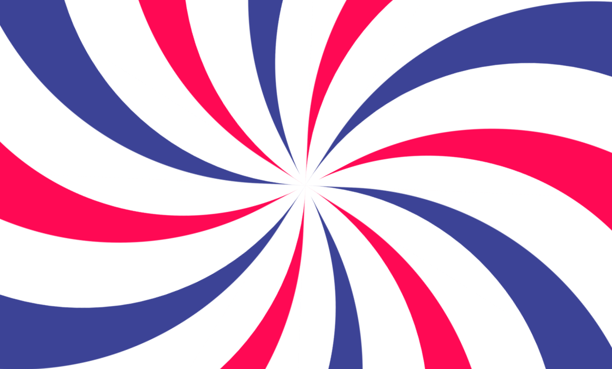

# 交错旋转的漩涡背景动画效果

## 概述
本篇文章主要实现的是一个具有 **旋转动画效果** 的网页背景。通过使用 `CSS` 的 **关键帧动画** 和 **动态计算旋转** 角度，创建一个具有特定形状和不同颜色 **持续旋转** 的动态视觉效果🌀。[showtime!](https://code.juejin.cn/pen/7309420381507420198)

主要由一个大的 `.box` 容器完成。这个容器占据了整个视口页面宽度和高度的 `200vw/vh`(全屏效果)，并且持续地进行旋转动画。在这个容器内部，有一些 `span` 元素。使用伪类选择器让 `::before` 伪元素具有不同的阴影颜色。然后 `span` 元素通过定位和改变转换原点(右下角)，根据CSS变量 `--i` 来动态计算每个旋转角度，形成围绕中心点旋转的漩涡。

<p align=center>

</p>

## HTML 结构
首先，看一下 `HTML` 文件部分。文件包含了一个简单的页面结构，页面的主要内容是 `box` 元素，被设置为绝对定位，占据了整个页面视口的宽度和高度，并被赋予了一个持续旋转的动画效果。

它包含了12个 `<span>` 元素。这些 `<span>` 元素会被设置为绝对定位叠在一起，然后根据定义的CSS变量计算旋转分布在 `.box` 元素内。
```html
<!DOCTYPE html>
<html lang="en">

<head>
  <meta charset="UTF-8">
  <meta name="viewport" content="width=device-width, initial-scale=1.0">
  <title>Swirl Background Animation</title>

  <link rel="stylesheet" href="./index.css">
</head>

<body>
  <div class="box">
    <!-- 12个 -->
    <span style="--i: 0;"></span>
    <span style="--i: 1;"></span>
    <span style="--i: 2;"></span>
    <span style="--i: 3;"></span>
    <span style="--i: 4;"></span>
    <span style="--i: 5;"></span>
    <span style="--i: 6;"></span>
    <span style="--i: 7;"></span>
    <span style="--i: 8;"></span>
    <span style="--i: 9;"></span>
    <span style="--i: 10;"></span>
    <span style="--i: 11;"></span>
  </div>
</body>

</html>
```

## CSS 样式
接下来是 `CSS` 部分。其中包括了一些重置样式、背景以及元素水平垂直居中布局等样式。还设置了 `overflow: hidden` 以隐藏页面内容水平垂直滚动条。
* 首先，为 `.box` 元素设置了固定宽高和内容水平垂直居中布局。还有 `span` 元素的宽高设置。
* 其次，通过 `::before` 伪元素设置圆角(边框底部左边角有一个大半径)以及色彩阴影(伪类选择器改变偶数元素的颜色)实现了涡旋形状。
* 接着，为 `span` 元素设置了绝对定位并改变转换原点(从底部右角开始进行旋转)，以及动态计算的旋转角度。
```css
* {
  margin: 0;
  padding: 0;
  box-sizing: border-box;
}

body {
  min-height: 100vh;
  background-color: #fff;
  
  display: flex;
  justify-content: center;
  align-items: center;

  overflow: hidden;
}

.box {
  position: absolute;

  width: 200vw;
  height: 200vh;

  display: flex;
  justify-content: center;
  align-items: center;
  
  animation: animate 10s linear infinite;
}
@keyframes animate {
  0% {
    transform: rotate(0deg);
  }

  100% {
    transform: rotate(360deg);
  }
}

.box span {
  width: 500px;
  height: 150vh;
  /* border: 1px solid #000; */
  
  position: absolute;
  transform-origin: bottom right;
  transform: translate(-50%, -50%) rotate(calc(30deg * var(--i)));
}

.box span::before {
  content: "";
  position: absolute;
  
  width: 100%;
  height: 100%;
  border-bottom-left-radius: 500px;
  box-shadow: -90px -90px 0 89px #ff0954;
}

.box span:nth-child(even)::before {
  box-shadow: -90px -90px 0 89px #3c4396;
}

```
然后，为`.box`元素添加了关键帧动画 `animate` 一个旋转动画，动画会使元素在10秒内旋转360度一周，且无限循环播放。

## 最后
本文的实现方法简洁明了，通过`HTML`和`CSS`的结合，实现了一个简单的看久就会晕的交错颜色 **持续旋转的漩涡背景** 动画效果。这个动画具有特殊的视觉效果，旋转起来让页面看起来更加生动。你也可以根据自己的需求进行调整，进一步改善和扩展这个效果。

希望这篇文章对你在开发类似交互动画效果时有所帮助！如果你对这个案列还有任何问题，欢迎在评论区留言或联系(私信)我。码字不易🥲，不要忘了三连鼓励🤟，谢谢阅读，Happy Coding🎉！

源码我放在了[GitHub](https://github.com/vnyoon/web-magic)，里面还有一些酷炫的效果、动画案列，喜欢的话不要忘了 `starred` 不迷路！
