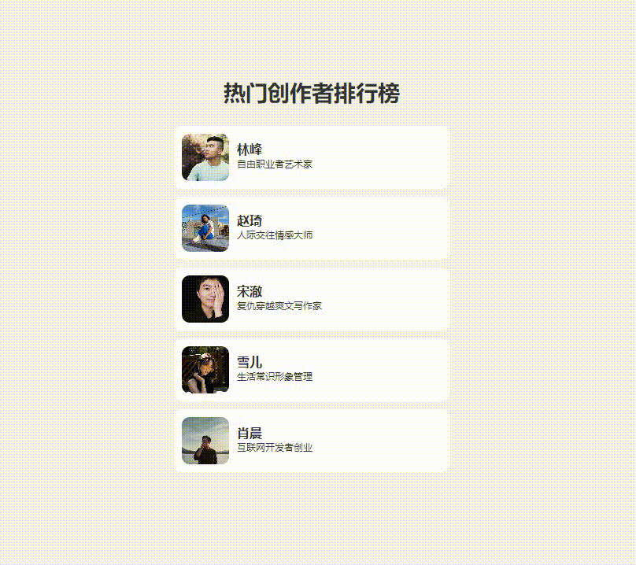
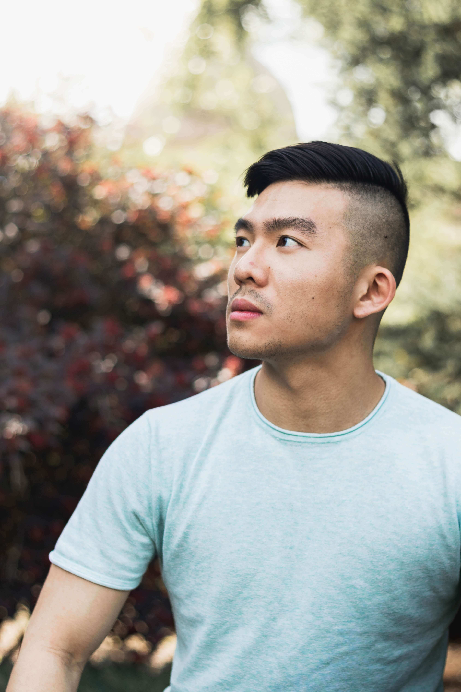
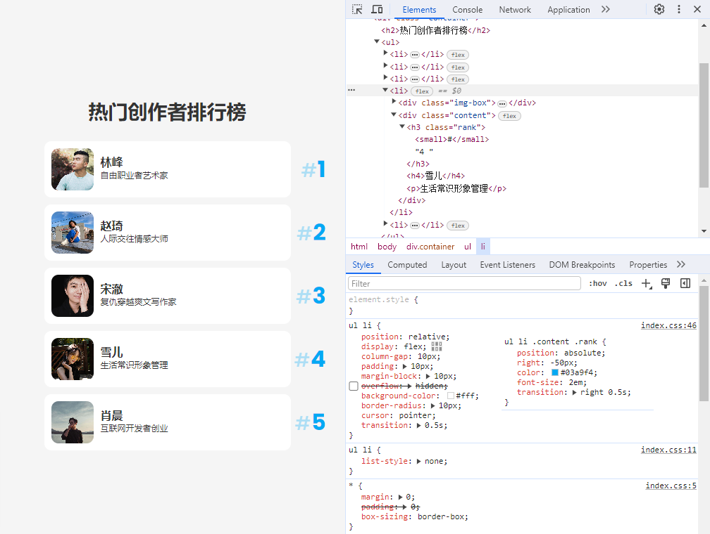

# 创意列表交互：带有焦点的排行榜悬停效果🥇

在网页布局中列表排列是最常见的布局之一。下面本篇文章将详细介绍使用 `HTML`、`CSS` 制作带有 **悬停交互效果** 的热门 **创作者排行榜** 列表网页。当鼠标悬浮到某项作者卡片上时该项会产生阴影和放大显示，便于查看一些信息介绍等。同时显示排名数，并且其它项添加模糊程度与降低透明度，以和当前浏览项产生视觉对比突出操作焦点🏅。[showtime!](https://code.juejin.cn/pen/7311325992256012327)

<p align=center>

</p>

## HTML 结构
首先，添加 `HTML` 代码。列表的标题使用 `<h3>` 标签展示。使用 `<ul>` 和 `<li>` 无序标签来构建了一些 **创作者排行榜**。而每个排行榜项都包含创作者的图片、排名、姓名和描述。将这些元素组合在一起，详细展示了每位创作者的信息。
```html
<!DOCTYPE html>
<html lang="en">

<head>
  <meta charset="UTF-8">
  <meta name="viewport" content="width=device-width, initial-scale=1.0">
  <title>List Hover Effects</title>

  <link rel="stylesheet" href="./css/index.css">
</head>

<body>
  <div class="container">
    <h2>热门创作者排行榜</h2>

    <ul>
      <li>
        <div class="img-box">
          
        </div>

        <div class="content">
          <h3 class="rank">
            <small>#</small>1
          </h3>

          <h4>林峰</h4>

          <p>自由职业者艺术家</p>
        </div>
      </li>

      <!-- 其它排行榜项，结构一样 -->
    </ul>
  </div>
</body>

</html>
```

## CSS 样式
接下来，`CSS` 代码其中包括了一些重置样式、背景以及元素水平垂直居中布局等样式。

### 基本布局
这部分代码包含了页面列表的静态样式定义。先给 `.container` 元素设置了内边距和标题居中等样式，`ul` 设置了最小宽度，`ul li` 定义了每个列表项的样式，包括行对齐布局、内外边距、背景色等。`.img-box` 设置了图片容器的大小。`.content` 定义了文字内容的布局，其内的 `.rank` 名次改变了特殊的颜色和相对于li定位的样式。
```css
/*google-fonts*/
/* @import url('https://fonts.googleapis.com/css?family=Poppins:200,300,400,500,600,700,800,900&display=swap'); */
@import './google-fonts.css';

* {
  margin: 0;  
  padding: 0; 
  box-sizing: border-box;
}

ul li { list-style: none; }

img {
  width: 100%;
  height: 100%;
  object-fit: cover;
}

body {
  font-family: 'Poppins', sans-serif;
  color: #333;
  
  min-height: 100vh;
  background-color: #f5f5f5;

  display: flex;
  justify-content: center;
  align-items: center;
}

.container { padding: 20px; }
.container h2 {
  font-size: 1.75em;
  margin-bottom: 20px;
  text-align: center;
}

ul {
  min-width: 350px;
}

ul li {
  position: relative;
  
  display: flex;
  column-gap: 10px;
  padding: 10px;
  margin-block: 10px;
  overflow: hidden;

  background-color: #fff;
  border-radius: 10px;

  cursor: pointer;
  transition: 0.5s;
}

ul li .img-box {
  width: 60px;
  height: 60px;

  border-radius: 10px;
  overflow: hidden;
}

ul li .content {
  display: flex;
  flex-direction: column;
  justify-content: center;
}

ul li .content .rank {
  position: absolute;
  right: -50px;

  color: #03a9f4;
  font-size: 2em;

  transition: right 0.5s;
}
ul li .content .rank small {
  font-weight: 500;
  opacity: 0.3;
}

ul li .content h4 {
  font-weight: 600;
  line-height: 1.2em;
}

ul li .content p {
  font-size: 0.75em;
}

```


### 动画效果
现在，来为排行榜项添加悬停效果。当用户将鼠标悬停在排行榜项上时 `ul li:hover`，显示阴影效果 `box-shadow`，并稍微放大该项 `scale(1.15)`，显示名次 `right: 20px;`。对于其它项 `ul:hover li` 添加模糊程度和降低透明度 `filter: blur(5px);opacity: 0.3;`，以突出显示当前正在交互的列表项创作者。
```css
ul:hover li {
  filter: blur(5px);
  opacity: 0.3;
}

ul li:hover { 
  box-shadow: -10px 20px 35px rgba(0, 0, 0, 0.15);
  transform: scale(1.15);
  filter: blur(0);
  opacity: 1;
}

ul li:hover .content .rank {
  right: 20px;
}
```

## 最后
通过本篇文章的介绍，相信能够帮助你更好地使用 `CSS` 来构建一个 **带悬停效果的创作者排行榜悬停** 效果，从而理解掌握和应用这个效果。巧妙的设置容器元素的样式，结合 **过渡属性** 等，实现了当鼠标悬停项上时，会看到阴影效果和略微放大该项的动画。从而引导用户关注到当前悬停的内容。

希望这篇文章对你在开发类似交互动画效果时有所帮助！如果你对这个案列还有任何问题，欢迎在评论区留言或联系(私信)我。码字不易🥲，不要忘了三连鼓励🤟，谢谢阅读，Happy Coding🎉！

源码我放在了[GitHub](https://github.com/vnyoon/web-magic)，里面还有一些酷炫的效果、动画案列，喜欢的话不要忘了 `starred` 不迷路！
