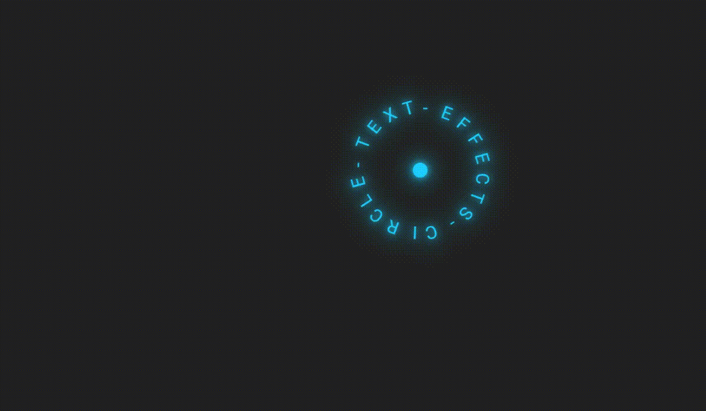

# 圆形文本鼠标光标动画效果

## 前面
本文将介绍如何使用 `HTML`、`CSS` 和 `JavaScript` 创建一个有趣的 **圆形文本鼠标移动** 动画效果。这个效果随着鼠标进入网页，会有一个由 **文字环绕组成的圆形中心圆点** 元素代替鼠标指针，并且文本和阴影会根据鼠标移动位置时产生变化。当鼠标移动时圆形会表现出旋转(向左/下移动会向左旋转反之移动向右旋转)，转动的过程中会有持续的颜色变化🏵️。[showtime](https://code.juejin.cn/pen/7313107715000107035)

<p align=center>

</p>

**<p align=center>移动端建议在PC端查看效果~😶</p>**

### 实现原理
* 使用CSS为 `.text` 元素添加样式关键帧动画 `@keyframes` 来创建了阴影和颜色持续变化的效果。
* 通过 `.text::before` 伪元素实现了中心的圆点。
* 然后，在 `JS` 部分，将文本元素的每个字符包裹在 `<span>` 标签中，随即就设置了每个span元素的旋转角度，并用CSS改变旋转圆点形成一个文本环绕的圆形。
* 再用 **鼠标移动事件** 根据鼠标位置调整文本元素的位置和旋转角度，从而实现与鼠标交互的动画效果。

## HTML 结构
首先，看 `HTML` 代码非常简单，就是定义了一个带有"text"类名的标题元素。这个元素将会被 `JS` 处理。另外就是引入外部CSS文件和JavaScript文件。
```html
<!DOCTYPE html>
<html lang="en">

<head>
  <meta charset="UTF-8">
  <meta name="viewport" content="width=device-width, initial-scale=1.0">
  <title>Circle Text Mousemove Animation Effects</title>

  <link rel="stylesheet" href="./css/index.css">
</head>

<body>
  <h2 class="text">circle - text - effects - </h2>

  <script src="./index.js"></script>
</body>

</html>
```

## CSS 样式
接下来，在 `CSS` 样式表中，定义了页面的基本样式，也重置了一些默认样式，设置了页面的布局背景颜色和标题文本元素的样式。

使用关键帧动画来创建动画效果，其中滤镜属性改变 **阴影和色相旋转值** 。默认情况下，文本元素是隐藏的 `opacity: 0`，并且在鼠标悬停在页面上时才显示出来。`.text::before` 用于创建一个圆点指针元素，以及 `span` 元素对每个字符进行改变旋转原点等样式调整。
```css
/* @import url('https://fonts.googleapis.com/css?family=Roboto:300,400,500,700,900&display=swap'); */
@import './google-fonts.css';

* {
  margin: 0;
  padding: 0;
  box-sizing: border-box;
}

:root { --primary-color: #0f0 }

body {
  min-height: 100vh;
  background-color: #222;
  font-family: 'Roboto', sans-serif;
  
  overflow: hidden;
  cursor: none;
}

.text {
  position: absolute;

  font-size: 1.5em;
  color: var(--primary-color);
  pointer-events: none;
  user-select: none;
  
  opacity: 0;
  transition: opacity 0.25s;
  animation: animate 5s linear infinite;
}
@keyframes animate { 
  0% {
    filter: drop-shadow(0 0 5px var(--primary-color))
            drop-shadow(0 0 15px var(--primary-color))
            hue-rotate(0);
  }

  100% {
    filter: drop-shadow(0 0 5px var(--primary-color))
            drop-shadow(0 0 15px var(--primary-color))
            hue-rotate(360deg);
  }
}

.text::before {
  content: "";
  position: absolute;
  transform: translate(-50%, -50%);

  width: 20px;
  height: 20px;
  background-color: var(--primary-color);
  border-radius: 50%;
}

.text span {
  position: absolute;
  top: -100px;

  text-transform: uppercase;
  font-weight: 400;
  transform-origin: 0 100px;
}

body:hover .text { opacity: 1; }

```

## JavaScript 交互
JavaScript部分主要负责处理鼠标移动事件以及更新标题元素的位置和样式：
* 首先，把标题元素的文本处理一下，除空白符之外的任意字符替换成 `<span>` 标签，并插入匹配到的字符串 `$&`。
* 其次，为每一个 `<span>` 元素设置旋转角度(360deg / 20个字符 = 18deg)。
* 接着，通过监听 `mousemove` 事件，获取鼠标相对文档的坐标，并持续更新标题元素的位置。同时，也根据坐标计算出标题元素的旋转角度，从而创造出移动时转圈的效果。
```js
const textEle = document.querySelector('.text');

textEle.innerHTML = textEle.textContent.replace(/\S/g, '<span>$&</span>');

const spanEle = document.querySelectorAll('span');
spanEle.forEach((ele, index) => {
  // index: 0 ~ 19
  ele.style.transform = `rotate(${index * 18}deg)`
});

document.addEventListener('mousemove', e => {
  textEle.style.left = `${e.pageX}px`;
  textEle.style.top = `${e.pageY}px`;

  textEle.style.transform = `rotate(${e.pageX / 2}deg) rotate(${e.pageY / -2}deg)`;
});

```
> 当 `transform` 同时设置了两个 `rotate` 旋转时，它们会按照从左到右的顺序依次应用于元素。
> 
> 例如，如果属性 `transform: rotate(30deg) rotate(-20deg)`，则首先会将元素按照顺时针方向旋转30度，然后在此基础上继续按照逆时针方向旋转20度。等于说时只顺时针转圈了10度。

## 最后
这种效果的核心在于 `JavaScript` 代码。使元素在用户的光标移动到网页时跟随光标，从而创建出 **动态移动转圈** 效果。总而言之，如果想要在某些界面上添加交互效果，此案例也是一种选择之一。现在通过结合 **前端三剑客**，你也可以创建出用户在移动鼠标时具有磁性效果的元素。

或者可以根据自己的需求进行调整，进一步改善和扩展这个效果。希望这篇文章对你在开发类似交互动画效果时有所帮助！如果你对这个案列还有任何问题，欢迎在评论区留言或联系(私信)我。码字不易🥲，不要忘了三连鼓励🤟，谢谢阅读，Happy Coding🎉！

源码我放在了[GitHub](https://github.com/vnyoon/web-magic)，里面还有一些酷炫的效果、动画案列，喜欢的话不要忘了 `starred` 不迷路！
